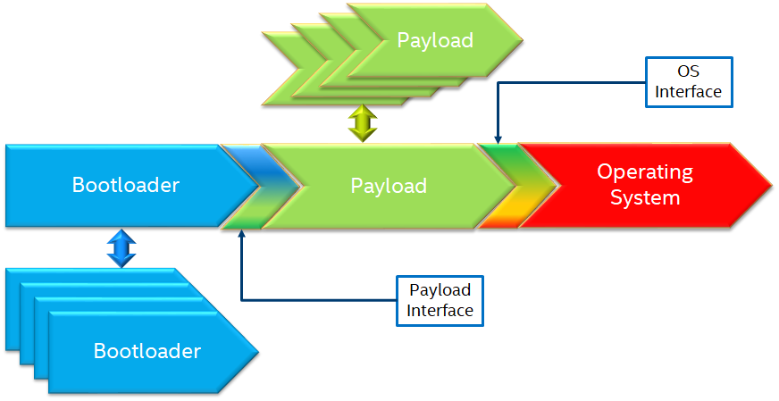

.. _universal_payload:

Universal Payload
===================

.. _introduction:

Introduction
-----------------

THIS SPECIFICATION IS PROVIDED "AS IS" WITH NO WARRANTIES WHATSOEVER, 
INCLUDING ANY WARRANTY OF MERCHANTABILITY, NONINFRINGEMENT, FITNESS 
FOR ANY PARTICULAR PURPOSE, OR ANY WARRANTY OTHERWISE ARISING OUT OF 
ANY PROPOSAL, SPECIFICATION OR SAMPLE. 

This specification is an intermediate draft for comment only and is
subject to change without notice. Readers should not design products
based on this document.

The **Universal Payload Project Team** provides the content on this site under a 
**Creative Commons Attribution 4.0 International license** (https://spdx.org/licenses/CC-BY-4.0.html) 
except where otherwise noted.

Other names and brands may be claimed as the property of others.

.. _purpose:

Purpose
---------

The purpose of this document is to describe the architecture and interfaces between the bootloader and the payload. Bootloader or payload implementation specific details are outside the scope of this document.

.. _intended-audience:

Intended Audience
-------------------

This document is targeted at all platform and system developers who need the bootloader or the payload supports the unified bootloader and payload interface. This includes, but is not limited to: BIOS developers, bootloader developers, system integrators, as well as end users.

.. _related-documents:

Related Documents
-------------------

-  Unified Extensible Firmware Interface (UEFI) Specification

   http://www.uefi.org/specifications

-  Platform Initialization (PI) Specification v1.7
   https://uefi.org/sites/default/files/resources/PI_Spec_1_7_final_Jan_2019.pdf

-  Portable Executable (PE) and Common Object File Format (COFF)

   https://docs.microsoft.com/en-us/windows/win32/debug/pe-format

-  PE authentication

   https://download.microsoft.com/download/9/c/5/9c5b2167-8017-4bae-9fde-d599bac8184a/Authenticode_PE.docx

-  ACPI DBG2 table

   http://download.microsoft.com/download/9/4/5/945703CA-EF1F-496F-ADCF-3332CE5594FD/microsoft-debug-port-table-2-CP.docx

-  ACPI specification 6.3

   https://uefi.org/sites/default/files/resources/ACPI_6_3_final_Jan30.pdf

-  Device tree specification

   https://buildmedia.readthedocs.org/pdf/devicetree-specification/latest/devicetree-specification.pdf

.. _overview:

Overview
----------

   Most modern platforms rely on system Firmware to initialize the
   hardware and launch an Operating System (OS). The system firmware is
   responsible for initializing the platform hardware including CPU and
   other silicon functional blocks, detecting and initializing the
   memory subsystem, boot media initialization and setting up hardware
   abstractions for use by the operating systems.

   While newer architectural enhancements (e.g. - PCI, PCIe, USB, etc.)
   are developed at an industrial scale, there are vendor specific
   micro-architectural enhancements that happens at a much faster pace.
   Silicon vendors differentiate through these microarchitectural
   enhancements and these features are often considered intellectual
   property and rely on system specific firmware initialization. The
   system firmware thus provides the necessary abstraction and allows a
   generic operating system to run on different platform configurations
   and technologies without needing any changes to the operating system
   itself.

   A design methodology of viewing system firmware functionality as made
   up of two distinct phases (**initialization** and **OS boot logic**)
   is gaining traction resulting in newer implementations of system
   firmware. This approach calls for modular phases with an
   initialization phase (bootloader) which completes the system
   initialization and gets the hardware to a usable state and then a
   payload phase. The payload can provide/implement many different
   functionalities including media and file system drivers, operating
   system boot, diagnostics, etc.

   While certain system firmware implementations implement both the
   initialization and OS boot logic in a single code base, the
   distinction lies in the functionality provided.

   This specification is used to describe the interface between the
   bootloader phase that initializes the system hardware and the payload
   phase. It includes how to pass parameters to payload and parameter
   format, payload image format, payload boot mode and stack usage, etc.
   The intent for this specification is to provide interoperability
   between spec compliant bootloaders and spec compliant payloads.

.. _bootloaders:

Bootloaders
-----------

   Bootloaders are primarily responsible for initializing the system
   hardware including, but not limited to CPU initialization, memory
   detection and initialization, initialization of silicon functional
   units (IO controllers), bus topology configuration, etc. In addition
   to the initialization itself, bootloader is responsible for providing
   the system configuration information to the subsequent stages in the
   boot process. In addition to proprietary options, there are many open
   sourced bootloaders available.

   **EDKII**

   EDK II is a modern, feature-rich, cross-platform firmware development
   environment for the UEFI and UEFI Platform Initialization (PI)
   specifications. EDKII performs both first stage (hardware
   initialization) and second stage booting.

   Reference implementations for many platforms are also available in
   open source under BSD + Patents license.

   https://www.tianocore.org/

   **Slim Bootloader**

   Slim Bootloader is an open source system firmware implementation that
   adopts the modular initialization followed by payload launch approach
   of system firmware design. Slim Bootloader project provides both the
   initialization phases as well as the OsLoader payload, but it also
   supports launching of different payloads. Open source Slim Bootloader
   uses BSD + Patents License.

   https://slimbootloader.github.io/

   **coreboot**

   coreboot is a project to develop open source boot firmware for
   various architectures. It follows the design philosophy of minimum
   necessary initialization followed by payload. coreboot is released
   under GNU's General Public License (GPL).

   https://www.coreboot.org/

   **U-Boot**

   U-Boot is an open-source, primary boot loader used in embedded
   devices. U-Boot performs both first stage (hardware initialization)
   and second stage booting. U-boot is released under GNU's General
   Public License (GPL)

   https://www.denx.de/wiki/U-Boot/WebHome

.. _payloads:

Payloads
--------

   After initializing the system hardware, bootloaders launch the
   payload modules. Payloads ideally are modular and platform
   independent. Payloads depend on the abstract interfaces (scope of
   this document) to be platform independent.

   While OS boot protocol is one of the main functionalities provided by
   payloads, there could be other functionalities (e.g - diagnostics)
   that can be enabled by payloads.

   From a design point of view, a payload is different from a boot image
   based on its relationship with the system firmware. Payloads are
   considered part of system firmware and is typically in the flash
   while boot images are not considered part of system firmware (not
   within the trusted firmware boundary) and is often in a boot media.

   Also, as mentioned earlier, while certain system firmware
   implementations implement both the initialization and OS boot logic
   in a single code base, the distinction lies in the functionality
   provided. This leads to use cases where some system firmware
   implementations can act as a payload providing OS boot capability
   while relying on an underlying bootloader layer for system hardware
   initialization. Examples of such payloads include EDKII and Uboot.
   Both EDKII and uboot implementations implement both phases of system
   firmware functionality and can also be launched as payloads by other
   bootloaders.

   There are many payloads currently available including EDK2 payload
   providing UEFI services, Linux as a payload, uboot payload and other
   custom implementations.

   **EDK II Payload**

   EDK II DXE and BDS stages can be launched by bootloaders as an UEFI
   payload. The EDKII payload provides the required UEFI specification
   defined architectural protocols and can launch an UEFI aware OS.

   **SBL OsLoader**

   It is SBL payload implementation that supports Linux boot protocol and
   can also launch ELF or PE executables. It also supports launching OS
   compliant with the MultiBoot specification.

   **Linux Payload**

   LinuxBoot is a firmware for modern servers that replaces specific
   firmware functionality like the UEFI DXE phase with a Linux kernel
   and runtime.

   https://www.linuxboot.org/

.. _bootloader-interfaces:

Bootloader interfaces
---------------------

Coreboot Payload Interface
~~~~~~~~~~~~~~~~~~~~~~~~~~

   **Reference**: https://www.coreboot.org/API

   **Reference**: https://doc.coreboot.org/lib/abi-data-consumption.html

   **Reference**:
   https://github.com/tianocore/edk2/blob/master/UefiPayloadPkg/Library/CbParseLib/CbParseLib.c

   coreboot passes information to downstream users (payloads and/or
   operating systems) using **coreboot tables**.

   The table usually sits in memory around address 0x500. However, some
   bootloaders seem to overwrite low memory area, thus destroying the
   coreboot table integrity, rendering the table useless. So, the
   coreboot tables were moved to the high tables area.

   When coreboot tables were moved to high memory, a 40 bytes mini
   coreboot table with a single sub table is placed at 0x500/0x530 that
   points to the real coreboot table. This is comparable to the ACPI
   RSDT or the MP floating table.

   Coreboot tables is a series of data records packed back to back and
   each encoding both type and size. This is something similar to a UEFI
   HOB list. Coreboot tables provide information about: 

   -  **memory map**

   -  **Graphics Info**

   -  Pointers to certain CBMEM structures (**ACPI, SMBIOS**, etc)

Slim Bootloader (SBL) Payload Interface
~~~~~~~~~~~~~~~~~~~~~~~~~~~~~~~~~~~~~~~

   **Reference**:
   https://slimbootloader.github.io/developer-guides/payload.html

   **Reference**:
   https://uefi.org/sites/default/files/resources/PI_Spec_1_7_final_Jan_2019.pdf

   **Reference**:
   https://github.com/tianocore/edk2/blob/master/UefiPayloadPkg/Library/SblParseLib/SblParseLib.c

   SBL supports 'loosely coupled payload' which basically refers to
   payloads built independently (no source sharing). SBL builds a series
   of data structures called the Hand Off Blocks (HOBs) and provides a
   pointer to this HOB List to the payloads. These data structures
   conform to the HOB format as described in the Platform Initialization
   (PI) Specification.

PEI to DXE Interface
~~~~~~~~~~~~~~~~~~~~

   **Reference**:
   https://uefi.org/sites/default/files/resources/PI_Spec_1_7_final_Jan_2019.pdf

   PEI must also provide a mechanism for components of DXE and the DXE
   Foundation to discover the state of the system when the DXE
   Foundation is invoked. Certain aspects of the system state at handoff
   are architectural, while other system state information may vary and
   hence must be described to DXE components.

   The DXE IPL PPI passes the Hand-Off Block (HOB) list from PEI to the
   DXE Foundation when it invokes the DXE Foundation. The handoff state
   is described in the form of HOBs in the HOB list.

+----------------------------------+----------------------------------+
| Required HOB Type                | Usage                            |
+==================================+==================================+
| Phase Handoff Information Table  | This HOB is required.            |
| (PHIT) HOB                       |                                  |
+----------------------------------+----------------------------------+
| One or more Resource Descriptor  | The DXE Foundation will use this |
| HOB(s) describing physical       | physical system memory for DXE.  |
| system memory                    |                                  |
+----------------------------------+----------------------------------+
| Boot-strap processor (BSP) Stack | The DXE Foundation needs to know |
| HOB                              | the current stack location so    |
|                                  | that it can move it if           |
|                                  | necessary, based upon its        |
|                                  | desired memory address map. This |
|                                  | HOB will be of type              |
|                                  | EfiConventionalMemory            |
+----------------------------------+----------------------------------+
| One or more Resource Descriptor  | The DXE Foundation will place    |
| HOB(s) describing firmware       | this into the GCD.               |
| devices                          |                                  |
+----------------------------------+----------------------------------+
| One or more Firmware Volume      | The DXE Foundation needs this    |
| HOB(s)                           | information to begin loading     |
|                                  | other drivers in the platform.   |
+----------------------------------+----------------------------------+
| A Memory Allocation Module HOB   | This HOB tells the DXE           |
|                                  | Foundation where it is when      |
|                                  | allocating memory into the       |
|                                  | initial system address map.      |
+----------------------------------+----------------------------------+

.. _os-interfaces:

OS interfaces
-------------

   While this specification aims to document the bootloader to payload
   interface, the payload to OS interface is briefly discussed just for
   the sake of completeness.

OS Boot protocols
~~~~~~~~~~~~~~~~~

   **UEFI**

   UEFI stands for "Unified Extensible Firmware Interface." The UEFI
   Specification defines a new model for the interface between
   personal-computer operating systems and platform firmware. The
   interface consists of data tables that contain platform-related
   information, plus boot and runtime service calls that are available
   to the operating system and its loader. Together, these provide a
   standard environment for booting an operating system and running
   pre-boot applications.

   https://uefi.org/specifications

   **Linux Boot Protocol**

   Linux kernel can itself be a bootable image without needing a
   separate OS Loader. The Linux boot protocol defines the requirements
   required to launch Linux kernel as a boot target.

   https://www.kernel.org/doc/html/latest/x86/boot.html

   **Multiboot Protocol**

   The Multiboot specification is an open standard describing how a boot
   loader can load an x86 operating system kernel. The specification
   allows any compliant boot-loader implementation to boot any compliant
   operating-system kernel. Thus, it allows different operating systems
   and boot loaders to work together and interoperate, without the need
   for operating system specific boot loaders.

   https://www.gnu.org/software/grub/manual/multiboot2/multiboot.html

Data interface
~~~~~~~~~~~~~~

   Modern buses and devices (PCI, PCIe, USB, SATA, etc.) support
   software detection, enumeration and configuration, providing true
   plug and play capabilities, there still exists some devices that are
   not enumerable through software.

   Examples:

   -  PCI Host Bridge

   -  GPIO

   -  Serial interfaces like I2C, HS-UART, etc.

   -  Graphics framebuffer

   -  Device Management information including manufacturer name, etc.

   While it is possible to write platform specific device drivers to
   support such devices/interfaces, it is efficient for the platform
   specific firmware to provide information to the platform independent
   operating system.

   There are two data protocols that are used extensively for this
   purpose: ACPI and Device Tree.

   **ACPI**

   Advanced Configuration and Power Interface (**ACPI**) provides an
   open standard that operating systems can use to discover and
   configure computer hardware components, to perform power management
   by (for example) putting unused components to sleep, and to perform
   status monitoring. In October 2013, ACPI Special Interest Group (ACPI
   SIG), the original developers of the ACPI standard, agreed to
   transfer all assets to the UEFI Forum, in which all future
   development will take place.

   **SMBIOS**

   System Management BIOS (**SMBIOS**) is the premier standard for
   delivering management information via system firmware.

   https://uefi.org/specifications

   https://www.dmtf.org/standards/smbios

   **DEVICE TREE**

   The devicetree is a data structure for describing hardware. A
   devicetree is a tree data structure with nodes that describe the
   devices in a system. Each node has property/value pairs that describe
   the characteristics of the device being represented.

   https://www.devicetree.org/

Payload principle
-----------------

   | Keep interface as clean and simple as possible.
   | The payload should encapsulate the boot abstractions for a given
     technology, such as UEFI payload or LinuxBoot. The Payload should
     vie to be portable to different platform implementations (PI), such
     as coreboot, Slim bootloader, or an EDKII style firmware.
   | The payload should elide strong dependencies on the payload
     launching code (e.g., coreboot versus EDKII versus slimboot) and
     also avoid board-specific dependencies. The payload behavior should
     be parameterized by the data input block.

   | **Open**\ *: Should Payload return back to bootloader if payload
     fail?*
   | *Answer: No for first generation. No callbacks into payload
     launcher.*

   **Open**\ *: Do we need callback from payload to bootloader? Avoid it
   if possible*

   | **Open**\ *: How to support SMM for booloader and Payload? Where is
     trust boundary.*
   | *Answer: SMM should be either part of the payload for present
     generation Management Mode (MM) PI drivers, but longer term the
     EDKII PI independent MM modules should be used. The latter are a
     class of SMM drivers (or TrustZone drivers for ARM) that are not
     launched via DXE. For coreboot SMM can be loaded from ramstage, the
     PI payload launcher, or elided from ramstage and use the portable
     MM handlers.*
   | If there is an existing standard it will be used (e.g., ACPI table
     that is simple to parse).

Security
--------

Payload is part of system firmware TCB

   Today the payload is provisioned as part of the platform
   initialization code. As such, the payload is protected and updated by
   the platform manufacturer (PM). The payload should be covered by a
   digital signature generated by the PM. The platform owner (PO) should
   not be able to update the payload independently of the PM.

   | The platform initialization (PI) code should be the platform root
     of trust for update, measurement, and verification. As such, the PI
     code that launches the payload should verify the payload using
     payload Hash or using a key to verify its signature. The PI code
     should also provide a measurement into a Trusted Platform Module
     (TPM) of the payload into a TPM Platform Configuration Register
     (e.g., PCR[0]). The payload may continue the measured boot actions
     by recording code executed in the payload phase into PCRs (e.g.,
     UEFI driver into PCR[2], UEFI OS loader into PCR[4]).
   | *Open: Do we need a capability boot to say if payload
     supports/requires measured/verified boot?*

Payload Image Format
====================

Payload, as a standalone component, usually needs to be loaded by a
bootloader into memory properly prior to execution. In this loading
process, additional process might be required, such as assembling,
rebasing, authenticating, etc. Today, many payloads use
their own image formats (PE, ELF, FV, RAW, etc.), and it is very
challenging for a bootloader to identify and support all of them.  

To address this, a common payload image format is desired to
facilitate the payload loading process. Instead of defining a new
image format for payloads, it is preferred to reuse an already-existing
format, such as ELF (Executable and Linkable Format) and PE (Portable
Executable). This specification selects the ELF image format as the
common universal payload image format since it is is flexible, extensible,
and cross-platform. It is also adopted by many different operating systems
on many different hardware platforms.

For detailed information on the ELF image format, please see
`ELF Specification <https://refspecs.linuxfoundation.org/elf/elf.pdf>`_ .

Payload Image Sections
----------------------
To use ELF image as universal payload image format, it is required to define
a simple way for bootloader to differenciate a universal payload image from
a regular ELF image. On the other side, a universal payload might aslo need
addtional image information to proceed with the boot flow. This specifciation
requires the universal payload image to provide these addtional requried
inforamtion through new defined ELF sections, *Universal Payload Information
Section* and *Universal Payload Loaded Image Section*.

Universal Payload Information Section
^^^^^^^^^^^^^^^^^^^^^^^^^^^^^^^^^^^^^

This specification requires a mandatory ELF universal payload information section
to indicate the ELF image conforms to this specification. If this section is found
inside the ELF image and is valid, the bootloader can retrieve universal payload
specific information from this section, such as payload version, payload ID, etc.
And the bootloader shall use the interfaces defined in this specification to handoff
the control to the payload.

This Universal Payload Information section must:

-  Have section name defined as ".upld_info"

-  Have section aligned at 4-byte boundary within the ELF image.

-  Contain UNIVERSAL_PAYLOAD_INFO structure in its section, as
   defined as below:

**UNIVERSAL_PAYLOAD_INFO Structure**

+-----------------+-----------------+-----------------+-----------------+
| **              | Size in Bytes   | Field           | Description     |
| **              |                 |                 |                 |
| Byte Offset     |                 |                 |                 |
+=================+=================+=================+=================+
| 0               | 4               | Identifier      | 'PLDH'          |
|                 |                 |                 | Identifier for  |
|                 |                 |                 | the unverial    |
|                 |                 |                 | payload info.   |
+-----------------+-----------------+-----------------+-----------------+
| 4               | 4               | HeaderLength    | Length of the   |
|                 |                 |                 | structure in    |
|                 |                 |                 | bytes.          |
+-----------------+-----------------+-----------------+-----------------+
| 8               | 2               | SpecRevision    | Indicates       |
|                 |                 |                 | compliance with |
|                 |                 |                 | a revision of   |
|                 |                 |                 | this            |
|                 |                 |                 | specification   |
|                 |                 |                 | in the BCD      |
|                 |                 |                 | format.         |
|                 |                 |                 |                 |
|                 |                 |                 | 7 : 0 - Minor   |
|                 |                 |                 | Version         |
|                 |                 |                 |                 |
|                 |                 |                 | 15 : 8 - Major  |
|                 |                 |                 | Version         |
|                 |                 |                 |                 |
|                 |                 |                 | For revision    |
|                 |                 |                 | v0.75 the value |
|                 |                 |                 | will be 0x0075. |
+-----------------+-----------------+-----------------+-----------------+
| 10              | 2               | Reserved        | Reserved for    |
|                 |                 |                 | future use.     |
+-----------------+-----------------+-----------------+-----------------+
| 12              | 4               | Revision        | Revision of the |
|                 |                 |                 | Payload         |
|                 |                 |                 | binary.         |
|                 |                 |                 | Major.Minor     |
|                 |                 |                 | .Revision.Build |
|                 |                 |                 |                 |
|                 |                 |                 | The             |
|                 |                 |                 | ImageRevision   |
|                 |                 |                 | can be decoded  |
|                 |                 |                 | as follows:     |
|                 |                 |                 |                 |
|                 |                 |                 |  7 : 0  - Build |
|                 |                 |                 | Number          |
|                 |                 |                 |                 |
|                 |                 |                 | 15 :8  -        |
|                 |                 |                 | Revision        |
|                 |                 |                 |                 |
|                 |                 |                 | 23 :16 - Minor  |
|                 |                 |                 | Version         |
|                 |                 |                 |                 |
|                 |                 |                 | 31 :24 - Major  |
|                 |                 |                 | Version         |
+-----------------+-----------------+-----------------+-----------------+
| 16              | 4               | Attribute       | Bit-field       |
|                 |                 |                 | attribute       |
|                 |                 |                 | indicator of    |
|                 |                 |                 | the payload     |
|                 |                 |                 | image.          |
|                 |                 |                 |                 |
|                 |                 |                 | BIT 0: Build    |
|                 |                 |                 | Type.           |
|                 |                 |                 |                 |
|                 |                 |                 | 0: Release Build|
|                 |                 |                 |                 |
|                 |                 |                 | 1: Debug Build  |
+-----------------+-----------------+-----------------+-----------------+
| 20              | 4               | Capability      | Bit-field       |
|                 |                 |                 | capability      |
|                 |                 |                 | indicator that  |
|                 |                 |                 | the payload     |
|                 |                 |                 | image can       |
|                 |                 |                 | support.        |
|                 |                 |                 |                 |
|                 |                 |                 | BIT 0: Support  |
|                 |                 |                 | SMM rebase      |
+-----------------+-----------------+-----------------+-----------------+
| 24              | 16              | ProducerId      | A               |
|                 |                 |                 | null-terminated |
|                 |                 |                 | OEM-supplied    |
|                 |                 |                 | string that     |
|                 |                 |                 | identifies the  |
|                 |                 |                 | payload         |
|                 |                 |                 | producer.       |
+-----------------+-----------------+-----------------+-----------------+
| 40              | 16              | ImageId         | A               |
|                 |                 |                 | null-terminated |
|                 |                 |                 | ASCII string    |
|                 |                 |                 | that identifies |
|                 |                 |                 | the payload     |
|                 |                 |                 | name.           |
+-----------------+-----------------+-----------------+-----------------+

Universal Payload Loaded Image Section
^^^^^^^^^^^^^^^^^^^^^^^^^^^^^^^^^^^^^^^

There are many cases that a payload might need extra images to proceed the
boot flow. For example, UEFI payload might need additional FV images, Linux
payload might need additional InitRd image, u-boot might need additional
device tree blob, etc. In these cases, it is desired to pass this additional
image information from bootloader to payload so that payload can consume these
images later.

This specification defines optional universal payload extra image sections. 
If exist, they holds extra image information to be passed into the universal
payload. Please note, multiple extra image sections might exist in single
universal payload ELF image.

If an universal payload extra image section needs to be provided, it
must:

-  Have unique section name defined as ".upld.*". The full section name string
   length needs to be less than 16. Here, ‘*’ can be any ASCII string.

-  Have section aligned at proper boundary within the ELF file as required by
   the nature of the extra image itself. For example, FV and InitRd might need
   4KB page-aligned.

-  Contain the raw extra image data in its section.

During payload image loading, the bootloader shall build these extra images into
HOB. And the universal payload can locate the information from the HOB and find
required extra image information for consumption. 

Hand-off state
==============

The bootloader builds the Hand-Off Block (HOB) list containing
platform specific information and passes the address of the HOB list
to the payload.

The prototype of payload entry point is defined as::

  typedef
  VOID
  (*PAYLOAD_ENTRY) (
    EFI_HOB_HANDOFF_INFO_TABLE *HobList
  );

The compiler need use a proper attributes for this function to meet the calling convention below.
For example, Microsoft Visual studio uses __cdecl for X64, while Linux GCC uses __attribute__((ms_abi)) for X64.

HOB List defines the detailed HOB list being used to transfer
platform specific data from the bootloader to the payload.

IA-32 and x64 Platforms
-----------------------

State of silicon
~~~~~~~~~~~~~~~~

   The bootloader initializes the processor and chipset through
   vendor-specific silicon initialization implementation. For example,
   FSP is a binary form of Intel silicon initialization implementation.
   Typically, when the control transfers to the payload:

-  The memory controller is initialized such that physical memory is
   available to use.

-  Processors (including application processors) are patched with
   microcode and initialized properly.

-  The PCI bus is assigned with proper bus numbers, IO/MMIO space.

-  The Graphics controller may be initialized properly.

..

   But the bootloader could do less silicon initialization if the
   responsibilities of the payload and the bootloader are well defined
   (out of the scope of this document).

Instruction execution environment
~~~~~~~~~~~~~~~~~~~~~~~~~~~~~~~~~

   Regardless of the environment where the bootloader runs, the
   processor is in 32bit protected mode when a 32bit payload starts, or
   in 64bit long-mode when a 64bit payload starts. The payload header
   contains the machine type information that the payload supports.

   The following sections provide a detailed description of the
   execution environment when the payload starts.

Registers
^^^^^^^^^

-  ESP + 4 points to the address of the HOB list for the 32bit payload.

-  RCX holds the address of the HOB list for the 64bit payload.

-  Direction flag in EFLAGs is clear so the string instructions process
   from low addresses to high addresses.

-  All other general-purpose register states are undefined.

-  Floating-point control word is initialized to 0x027F (all exceptions
   masked, double-precision, round-to-nearest).

-  | Multimedia-extensions control word (if supported) is initialized to
     0x1F80 (all exceptions
   | masked, round-to-nearest, flush to zero for masked underflow).

-  CR0.EM is clear.

-  CR0.TS is clear.

Interrupt
^^^^^^^^^

   Interrupt is disabled. The hardware is initialized by the boot loader
   such that no interrupt triggers even when the payload sets the
   Interrupt Enable flag in EFLAGs.

Page table
^^^^^^^^^^

   Selectors are set to be flat.

   Paging mode may be enabled for the 32bit payload. (have general term
   on how it could be enabled if enabling page mode).

   Paging mode is enabled for the 64bit payload.

   When paging is enabled, all memory space is identity mapped (virtual
   address equals physical address). The four-level page table is set
   up. The payload can choose to set up the five-level page table as
   needed.

Stack
^^^^^

   4KiB stack is available for the payload. The stack is 16-byte aligned
   and may be marked as non-executable in page table.

   discussion: Should payload declare its required stack size in the
   payload header?

   Payload could setup its own stack, there is no restriction to setup a
   new stack.

Application processors
^^^^^^^^^^^^^^^^^^^^^^

   Payload starts on the bootstrap processor. All application processors
   (on a multiple-processor system) are in halt state.

   Use mWait and mBox to wake up. (Follow ACPI table). How about the
   legacy bootloader? Assume something if ACPI is not there.

   TODO: take care about virtual platforms.

ARM Platforms
-------------

Need community inputs

RISC-V Platforms
----------------

Need community inputs

Payload Interfaces
==================

The bootloader provides platform information to payload through
standard ACPI table, SMBIOS table, Device tree and a series of data
structures called the Hand Off Blocks (HOBs). If the information is
already defined in ACPI specification, SMBIOS specification or device
tree, the payload could parse them to get the required information.
For the platform information that is not defined in the standard
tables, the bootloader should build a HOB list to pass it to the
payload.

Open: Do we need a set of configuration data to config payload?

  We do not believe so.

Open: Do we need pass data from payload to bootloader to impact bootloader behavior in next boot?

  Keep it open now.

Open: will payload be run in S3 path?

  Suggest skipping payload.

.. _acpi_tables:

ACPI tables
-----------

ACPI table is required to boot modern operation system, especially to boot windows operating system.
The bootloader should provide a ACPI RSDP HOB. In the ACPI table least RSDT, FADT and MCFG should be available to the payload.
Payload could remove/add/modify the ACPI table passed from the bootloader if required.

The payload could parse the ACPI table to get some basic platform
information. For example, the Fixed ACPI Description Table (FADT)
defines various fixed hardware ACPI information to an ACPI compatible
OS, such as the base address for the following hardware registers
blocks: PM1a_CNT_BLK, PM_TMR_BLK, PM1a_EVT_BLK, GPE0_BLK,
PM1b_EVT_BLK, PM1b_CNT_BLK, PM2_CNT_BLK, and GPE1_BLK. The payload
could use them and other values (e.g. RESET_REG, RESET_VALUE) to make
the payload platform independent.

The other example is to get PCIE base address from ACPI memory mapped
configuration space access table definition, defined in the PCI
Firmware Specification.
`http://www.pcisig.com <http://www.pcisig.com/>`.

And another example is on the debug device info. The bootloader might
report debug device following up ACPI Debug Port Table 2 (DBG2). If a
fully 16550-compatible serial device is specified in the ACPI DBG2,
bootloader should provide a Serial Debug Information HOB in the HOB
list so that the payload could use same debug device with same
setting. If the ACPI DBG2 table could not be found, the payload
should use serial device provided by the Serial Debug Information HOB
as the default debug device.

.. hob_list:

HOB List
--------

The bootloader should build a HOB list and pass the HOB list header
to payload when passing control to payload. The HOB format is
described in the *Platform Initialization (PI) Specification - Volume
3: Shared Architectural Elements*.

There are two sections below describing the HOBs produced by the
bootloader and consumed by the payload for providing the system
architecturally information.

First section describes the HOBs defined in *Platform Initialization
Specification Volume 3: Shared Architectural elements*.

Second section defines the new HOBs.

Reusing Interfaces in Platform Initialization Specification
~~~~~~~~~~~~~~~~~~~~~~~~~~~~~~~~~~~~~~~~~~~~~~~~~~~~~~~~~~~

PHIT(Phase Handoff Info Table) HOB
^^^^^^^^^^^^^^^^^^^^^^^^^^^^^^^^^^

The bootloader should report the general state information through
the HOB following EFI_HOB_HANDOFF_INFO_TABLE format defined in
*Platform Initialization Specification Volume 3: Shared Architectural
elements*.

CPU HOB
^^^^^^^

The bootloader should report the processor information including address space
and I/O space capabilities to the payload through the HOB following
EFI_HOB_CPU format defined in *Platform Initialization Specification Volume 3:
Shared Architectural elements*.

Resource Descriptor HOB
^^^^^^^^^^^^^^^^^^^^^^^

The bootloader should report the system resources through the HOB
following EFI_HOB_RESOURCE_DESCRIPTOR format defined in *Platform
Initialization Specification Volume 3: Shared Architectural
elements*.

For example, any physical memory found in bootloader should be
reported using resource type EFI_RESOURCE_SYSTEM_MEMORY, and the
reserved memory used by bootloader should be reported using resource
type EFI_RESOURCE_MEMORY_RESERVED.

I/O and memory mapped I/O resource should also be reported using
resource type EFI_RESOURCE_IO and EFI_RESOURCE_MEMORY_MAPPED_IO.

Memory Allocation HOB
^^^^^^^^^^^^^^^^^^^^^

The bootloader should report the memory usages that exist outside the
HOB list through the HOB following EFI_HOB_MEMORY_ALLOCATION format defined
in *Platform Initialization Specification Volume 3: Shared Architectural
elements*.

Boot-Strap Processor (BSP) Stack Memory Allocation HOB
''''''''''''''''''''''''''''''''''''''''''''''''''''''

The bootloader should report the initial stack prepared for payload through
the HOB following EFI_HOB_MEMORY_ALLOCATION_STACK format defined in *Platform
Initialization Specification Volume 3: Shared Architectural elements*.

Memory Allocation Module HOB
''''''''''''''''''''''''''''

The bootloader should report the payload memory location and entry point
through the HOB following EFI_HOB_MEMORY_ALLOCATION_MODULE format defined
in *Platform Initialization Specification Volume 3: Shared Architectural
elements*.

Graphics information HOB
^^^^^^^^^^^^^^^^^^^^^^^^

If bootloader initializes the graphics device, the bootloader might
report graphics mode and framebuffer information through
EFI_PEI_GRAPHICS_INFO_HOB, and graphics hardware information
through EFI_PEI_GRAPHICS_DEVICE_INFO_HOB.

EFI_PEI_GRAPHICS_INFO_HOB and EFI_PEI_GRAPHICS_DEVICE_INFO_HOB provide the basic information
for the graphics display. These HOBs are described in the *PI Specification.*

Please refer Appendix 6.6 EFI_PEI_GRAPHICS_INFO_HOB and 6.7 EFI_PEI_GRAPHICS_DEVICE_INFO_HOB for the details.

New Interfaces
~~~~~~~~~~~~~~

Common Payload Header
^^^^^^^^^^^^^^^^^^^^^^^^^

All new interfaces are GUID type HOBs starting with ``EFI_HOB_GUID_TYPE`` defined in the PI Specification.

The HOB data starts with a common header defined as below::

  #pragma pack(1)
  
  typedef struct {
    UINT8                Revision;
    UINT8                Reserved;
    UINT16               Length;
  } UNIVERSAL_PAYLOAD_GENERIC_HEADER;

  #pragma pack()

``Revision``

It doesn't increase when new members are appended to the end of the interface.

It increases by one when existing members are renamed or re-interpreted for different purposes.

``Length``

The Length equals to the sizeof (UNIVERSAL_PAYLOAD_GENERIC_HEADER) + sizeof (<additional members>).

Consumers of the interfaces should only access those members that are covered by Length.

.. note::
  ``EFI_HOB_GUID_TYPE`` contains a Length field to tell the actual bytes the whole HOB data occupies.

  It also includes the optional padding bytes to make sure each HOB is multiple of 8 bytes in length.

  ``UNIVERSAL_PAYLOAD_GENERIC_HEADER.Length`` tells the exact length of the meaningful data excluding the padding bytes.
  So, it's always true that ``UNIVERSAL_PAYLOAD_GENERIC_HEADER.Length`` is less than or equal to the Length in ``EFI_HOB_GUID_TYPE``.

HOB data for different interfaces is defined in following sections.

ACPI Table
^^^^^^^^^^

The bootloader should pass ACPI table the payload. So that the payload could get the platform information from the ACPI table.

**GUID**

::

  gUniversalPayloadAcpiTableGuid = { 0x9f9a9506, 0x5597, 0x4515, { 0xba, 0xb6, 0x8b, 0xcd, 0xe7, 0x84, 0xba, 0x87 } }

**Structure**

::

  #pragma pack (1)

  typedef struct {
    UNIVERSAL_PAYLOAD_GENERIC_HEADER Header;
    EFI_PHYSICAL_ADDRESS             Rsdp;
  } UNIVERSAL_PAYLOAD_ACPI_TABLE;

  #pragma pack()

**Member Description**

``Header``

Header.Revision is 1.

Header.Length is 12.

``Rsdp``

Point to the ACPI RSDP table. The ACPI table need follow ACPI specification version 2.0 or above.

SMBIOS Table
^^^^^^^^^^^^

The bootloader might pass SMBIOS table to the payload. So that the payload could get the platform information from the table.

**GUID**

::

  gUniversalPayloadSmbios3TableGuid = { 0x92b7896c, 0x3362, 0x46ce, { 0x99, 0xb3, 0x4f, 0x5e, 0x3c, 0x34, 0xeb, 0x42 } }

  gUniversalPayloadSmbiosTableGuid = { 0x590a0d26, 0x06e5, 0x4d20, { 0x8a, 0x82, 0x59, 0xea, 0x1b, 0x34, 0x98, 0x2d } }

**Structure**

::

  #pragma pack (1)

  typedef struct {
    UNIVERSAL_PAYLOAD_GENERIC_HEADER Header;
    EFI_PHYSICAL_ADDRESS             SmBiosEntryPoint;
  } UNIVERSAL_PAYLOAD_SMBIOS_TABLE;

  #pragma pack()

**Member Description**

``Header``

Header.Revision is 1.

Header.Length is 12.

``SmBiosEntryPoint``

Points to the SMBIOS table in SMBIOS 3.0+ format if GUID is ``gUniversalPayloadSmbios3TableGuid``.

Points to the SMBIOS table in SMBIOS 2.x format if GUID is ``gUniversalPayloadSmbiosTableGuid``.

DEVICE TREE
^^^^^^^^^^^

The bootloader might pass Device Tree to the payload. So that the payload could get the platform information from the table.

**GUID**

::

  gUniversalPayloadDeviceTreeGuid = {0x6784b889, 0xb13c, 0x4c3b, {0xae, 0x4b, 0xf, 0xa, 0x2e, 0x32, 0xe, 0xa3}}

**Structure**

::

  #pragma pack (1)

  typedef struct {
    UNIVERSAL_PAYLOAD_GENERIC_HEADER Header;
    EFI_PHYSICAL_ADDRESS             DeviceTreeAddress;
  } UNIVERSAL_PAYLOAD_DEVICE_TREE;

  #pragma pack()

**Member Description**

``Header``

Header.Revision is 1.

Header.Length is 12.

``DeviceTreeAddress``

Point to the Device Tree entry point.

Serial Information
^^^^^^^^^^^^^^^^^^

If the debug device type and subtype are specified in DBG2, the
bootloader should 16550 compatible serial debug port information
to payload.

**Opens: Should we let bootloader provide debug callback** **for debug?**

**GUID**

::

  gUniversalPayloadSerialPortInfoGuid   = {0xaa7e190d, 0xbe21, 0x4409, {0x8e, 0x67, 0xa2, 0xcd, 0xf, 0x61, 0xe1, 0x70}}

**Structure**

::

  #pragma pack(1)

  typedef struct {
    UNIVERSAL_PAYLOAD_GENERIC_HEADER Header;
    BOOLEAN                          UseMmio;
    UINT8                            RegisterStride;
    UINT32                           BaudRate;
    EFI_PHYSICAL_ADDRESS             RegisterBase;
  } UNIVERSAL_PAYLOAD_SERIAL_PORT_INFO;

  #pragma pack()

**Member Description**

``Header``

Header.Revision is 1.

Header.Length is 18.

``UseMmio``

Indicates the 16550 serial port registers are in MMIO space, or in I/O space.

``RegisterStride``

Indicates the number of bytes between registers.

``BaudRate``

Baud rate for the 16550 compatible serial port.

It could be 921600, 460800, 230400, 115200, 57600, 38400, 19200,
9600, 7200, 4800, 3600, 2400, 2000, 1800, 1200, 600, 300, 150, 134,
110, 75, 50

Set to 0 to use the default baud rate 115200.

``RegisterBase``

Base address of 16550 serial port registers in MMIO or I/O space.

PCI Root Bridges
^^^^^^^^^^^^^^^^

The bootloader should pass information about PCI root bridges to the payload. The information tells the payload whether the PCI bus
enumeration has been performed by the bootloader, the bus, IO and MMIO ranges that are used or will be used by the PCI bus.

**GUID**

::

  gUniversalPayloadPciRootBridgeInfoGuid = { 0xec4ebacb, 0x2638, 0x416e, { 0xbe, 0x80, 0xe5, 0xfa, 0x4b, 0x51, 0x19, 0x01 }}

**Structure**

::

  #pragma pack(1)

  typedef struct {
    UNIVERSAL_PAYLOAD_GENERIC_HEADER  Header;
    BOOLEAN                           ResourceAssigned;
    UINT8                             Count;
    UNIVERSAL_PAYLOAD_PCI_ROOT_BRIDGE RootBridge[0];
  } UNIVERSAL_PAYLOAD_PCI_ROOT_BRIDGES;

  typedef struct {
    UINT32                                     Segment;
    UINT64                                     Supports;
    UINT64                                     Attributes;
    BOOLEAN                                    DmaAbove4G;
    BOOLEAN                                    NoExtendedConfigSpace;
    UINT64                                     AllocationAttributes;
    UNIVERSAL_PAYLOAD_PCI_ROOT_BRIDGE_APERTURE Bus;
    UNIVERSAL_PAYLOAD_PCI_ROOT_BRIDGE_APERTURE Io;
    UNIVERSAL_PAYLOAD_PCI_ROOT_BRIDGE_APERTURE Mem;
    UNIVERSAL_PAYLOAD_PCI_ROOT_BRIDGE_APERTURE MemAbove4G;
    UNIVERSAL_PAYLOAD_PCI_ROOT_BRIDGE_APERTURE PMem;
    UNIVERSAL_PAYLOAD_PCI_ROOT_BRIDGE_APERTURE PMemAbove4G;
    UINT32                                     HID;
    UINT32                                     UID;
  } UNIVERSAL_PAYLOAD_PCI_ROOT_BRIDGE;

  //
  // (Base > Limit) indicates an aperture is not available.
  //
  typedef struct {
    //
    // Base and Limit are the device address instead of host address when
    // Translation is not zero
    //
    UINT64 Base;
    UINT64 Limit;
    //
    // According to UEFI 2.7, Device Address = Host Address + Translation,
    // so Translation = Device Address - Host Address.
    // On platforms where Translation is not zero, the subtraction is probably to
    // be performed with UINT64 wrap-around semantics, for we may translate an
    // above-4G host address into a below-4G device address for legacy PCIe device
    // compatibility.
    //
    // NOTE: The alignment of Translation is required to be larger than any BAR
    // alignment in the same root bridge, so that the same alignment can be
    // applied to both device address and host address, which simplifies the
    // situation and makes the current resource allocation code in generic PCI
    // host bridge driver still work.
    //
    UINT64 Translation;
  } UNIVERSAL_PAYLOAD_PCI_ROOT_BRIDGE_APERTURE;
  #pragma pack()

**Member Description**

``Header``

Header.Revision is 1.

Header.Length is 6 + ``Count`` * sizeof (UNIVERSAL_PAYLOAD_PCI_ROOT_BRIDGE).

``ResourceAssigned``

Bus/IO/MMIO resources for all root bridges have been assigned when it's TRUE.

``Count``

Count of root bridges. Number of elements in ``RootBridge`` array.

``RootBridge[i].Segment``

Segment number of the root bridge.

``RootBridge[i].Supports``

Supported attributes. Refer to EFI_PCI_ATTRIBUTE_xxx used by GetAttributes() and SetAttributes() in EFI_PCI_ROOT_BRIDGE_IO_PROTOCOL
defined in PI Specification.

``RootBridge[i].Attributes``

Initial attributes. Refer to EFI_PCI_ATTRIBUTE_xxx used by GetAttributes() and SetAttributes() in EFI_PCI_ROOT_BRIDGE_IO_PROTOCOL
defined in PI Specification.

``RootBridge[i].DmaAbove4G``

Root bridge supports DMA above 4GB memory when it's TRUE.

``RootBridge[i].NoExtendedConfigSpace``

Root bridge supports 256-byte configuration space only when it's TRUE.
Root bridge supports 4K-byte configuration space when it's FALSE.

``RootBridge[i].AllocationAttributes``

Allocation attributes. Refer to EFI_PCI_HOST_BRIDGE_COMBINE_MEM_PMEM and EFI_PCI_HOST_BRIDGE_MEM64_DECODE used by GetAllocAttributes()
in EFI_PCI_HOST_BRIDGE_RESOURCE_ALLOCATION_PROTOCOL defined in PI Specification.

``RootBridge[i].Bus``

Bus aperture for the root bridge.

``RootBridge[i].Io``

IO aperture for the root bridge.

``RootBridge[i].Mem``

MMIO aperture below 4GB for the root bridge.

``RootBridge[i].MemAbove4G``

MMIO aperture above 4GB for the root bridge.

``RootBridge[i].PMem``

Prefetchable MMIO aperture below 4GB for the root bridge.

``RootBridge[i].PMemAbove4G``

Prefetchable MMIO aperture above 4GB for the root bridge.

``RootBridge[i].HID``

PnP hardware ID of the root bridge. This value must match the corresponding _HID in the ACPI name space.

``RootBridge[i].UID``

Unique ID that is required by ACPI if two devices have the same _HID. This value must also match the corresponding _UID/_HID pair in the ACPI name space.

Optional Interfaces
~~~~~~~~~~~~~~~~~~~

Some more HOBs could be built by bootloaders for advanced features. e.g.:

  Support FVs (also other format) from bootloader to payload

  Add debug log as HOB to payload

**Opens**: Does the bootloader need report IO info to payload?

      Better let the bootloader to report it,

**Opens**: does the HOB List need a checksum?

      It looks not too much value. Keep it open if we really need it.

**Opens**: For some information it is already in ACPI table, should bootloader build HOB for same info?

      Payload could have a check to ACPI table to get basic info they need.

Appendix A – HOB Data Structures
================================

The declarations/definitions provided here are derived from the EDKII at https://github.com/tianocore/edk2

Base Data Type
--------------

https://github.com/tianocore/edk2/blob/master/MdePkg/Include/Base.h::

  typedef struct {
    UINT32     Data1;
    UINT16     Data2;
    UINT16     Data3;
    UINT8      Data4[8];
  } GUID;

https://github.com/tianocore/edk2/blob/master/MdePkg/Include/Uefi/UefiBaseType.h::

  typedef    GUID       EFI_GUID;
  typedef    UINT64     EFI_PHYSICAL_ADDRESS;

EFI HOB TYPE
------------

https://github.com/tianocore/edk2/blob/master/MdePkg/Include/Pi/PiHob.h::

  //
  // HobType of EFI_HOB_GENERIC_HEADER.
  //
  #define EFI_HOB_TYPE_HANDOFF              0x0001
  #define EFI_HOB_TYPE_MEMORY_ALLOCATION    0x0002
  #define EFI_HOB_TYPE_RESOURCE_DESCRIPTOR  0x0003
  #define EFI_HOB_TYPE_GUID_EXTENSION       0x0004
  #define EFI_HOB_TYPE_FV                   0x0005
  #define EFI_HOB_TYPE_CPU                  0x0006
  #define EFI_HOB_TYPE_MEMORY_POOL          0x0007
  #define EFI_HOB_TYPE_FV2                  0x0009
  #define EFI_HOB_TYPE_LOAD_PEIM_UNUSED     0x000A
  #define EFI_HOB_TYPE_UEFI_CAPSULE         0x000B
  #define EFI_HOB_TYPE_FV3                  0x000C
  #define EFI_HOB_TYPE_UNUSED               0xFFFE
  #define EFI_HOB_TYPE_END_OF_HOB_LIST      0xFFFF

EFI_HOB_GENERIC_HEADER
----------------------

https://github.com/tianocore/edk2/blob/master/MdePkg/Include/Pi/PiHob.h::

  ///
  /// Describes the format and size of the data inside the HOB.
  /// All HOBs must contain this generic HOB header.
  ///
  typedef struct {
    ///
    /// Identifies the HOB data structure type.
    ///
    UINT16   HobType;
    ///
    /// The length in bytes of the HOB.
    ///
    UINT16   HobLength;
    ///
    /// This field must always be set to zero.
    ///
    UINT32   Reserved;
  } EFI_HOB_GENERIC_HEADER;

HOB List Header
---------------

EFI_HOB_HANDOFF_INFO_TABLE
~~~~~~~~~~~~~~~~~~~~~~~~~~

https://github.com/tianocore/edk2/blob/master/MdePkg/Include/Pi/PiHob.h::

  ///
  /// Contains general state information used by the HOB producerphase.
  /// This HOB must be the first one in the HOB list.
  ///
  typedef struct {
    ///
    /// The HOB generic header. Header.HobType = EFI_HOB_TYPE_HANDOFF.
    ///
    EFI_HOB_GENERIC_HEADER Header;

    ///
    /// The version number pertaining to the PHIT HOB definition.
    /// This value is four bytes in length to provide an 8-byte aligned entry
    /// when it is combined with the 4-byte BootMode.
    ///
    UINT32 Version;

    ///
    /// The system boot mode as determined during the HOB producer phase.
    ///
    EFI_BOOT_MODE BootMode;

    ///
    /// The highest address location of memory that is allocated for use by the HOB producer
    /// phase. This address must be 4-KB aligned to meet page restrictions of UEFI.
    ///
    EFI_PHYSICAL_ADDRESS EfiMemoryTop;

    ///
    /// The lowest address location of memory that is allocated for use by the HOB producer phase.
    ///
    EFI_PHYSICAL_ADDRESS EfiMemoryBottom;

    ///
    /// The highest address location of free memory that is currently available
    /// for use by the HOB producer phase.
    ///
    EFI_PHYSICAL_ADDRESS EfiFreeMemoryTop;

    ///
    /// The lowest address location of free memory that is available for use by the HOB producer phase.
    ///
    EFI_PHYSICAL_ADDRESS EfiFreeMemoryBottom;

    ///
    /// The end of the HOB list.
    ///
    EFI_PHYSICAL_ADDRESS EfiEndOfHobList;
  } EFI_HOB_HANDOFF_INFO_TABLE;

EFI_HOB_HANDOFF_TABLE_VERSION
~~~~~~~~~~~~~~~~~~~~~~~~~~~~~

https://github.com/tianocore/edk2/blob/master/MdePkg/Include/Pi/PiHob.h::

  ///
  /// Value of version in EFI_HOB_HANDOFF_INFO_TABLE.
  ///
  #define    EFI_HOB_HANDOFF_TABLE_VERSION    0x0009

EFI_BOOT_MODE
~~~~~~~~~~~~~

https://github.com/tianocore/edk2/blob/master/MdePkg/Include/Pi/PiBootMode.h::

  ///
  /// EFI boot mode
  ///
  typedef UINT32 EFI_BOOT_MODE;

  //
  // 0x21 - 0xff are reserved.
  //
  #define BOOT_WITH_FULL_CONFIGURATION                  0x00
  #define BOOT_WITH_MINIMAL_CONFIGURATION               0x01
  #define BOOT_ASSUMING_NO_CONFIGURATION_CHANGES        0x02
  #define BOOT_WITH_FULL_CONFIGURATION_PLUS_DIAGNOSTICS 0x03
  #define BOOT_WITH_DEFAULT_SETTINGS                    0x04
  #define BOOT_ON_S4_RESUME                             0x05
  #define BOOT_ON_S5_RESUME                             0x06
  #define BOOT_WITH_MFG_MODE_SETTINGS                   0x07
  #define BOOT_ON_S2_RESUME                             0x10
  #define BOOT_ON_S3_RESUME                             0x11
  #define BOOT_ON_FLASH_UPDATE                          0x12
  #define BOOT_IN_RECOVERY_MODE                         0x20

EFI_HOB_GUID_TYPE
-----------------

This is the generic HOB header for GUID type HOB.

https://github.com/tianocore/edk2/blob/master/MdePkg/Include/Pi/PiHob.h::

  ///
  /// Allows writers of executable content in the HOB producer phase to
  /// maintain and manage HOBs with specific GUID.
  ///

  typedef struct {
    ///
    /// The HOB generic header. Header.HobType = EFI_HOB_TYPE_GUID_EXTENSION.
    ///
    EFI_HOB_GENERIC_HEADER Header;

    ///
    /// A GUID that defines the contents of this HOB.
    ///
    EFI_GUID Name;

    //
    // Guid specific data goes here
    //
  } EFI_HOB_GUID_TYPE;

EFI_PEI_GRAPHICS_INFO_HOB
--------------------------

https://github.com/tianocore/edk2/blob/master/MdePkg/Include/Guid/GraphicsInfoHob.h

https://github.com/tianocore/edk2/blob/master/MdePkg/Include/Protocol/GraphicsOutput.h::

  **HOB GUID**
  #define    EFI_PEI_GRAPHICS_INFO_HOB_GUID    {0x39f62cce, 0x6825, 0x4669, {0xbb, 0x56, 0x54, 0x1a, 0xba, 0x75, 0x3a, 0x07}}

**Hob Interface Structure**::

  typedef struct {
    EFI_PHYSICAL_ADDRESS                    FrameBufferBase;
    UINT32                                  FrameBufferSize;
    EFI_GRAPHICS_OUTPUT_MODE_INFORMATION    GraphicsMode;
  } EFI_PEI_GRAPHICS_INFO_HOB;

**Related Definitions**::

  typedef struct {
    UINT32 RedMask;
    UINT32 GreenMask;
    UINT32 BlueMask;
    UINT32 ReservedMask;
  } EFI_PIXEL_BITMASK;

If a bit is set in *RedMask*, *GreenMask*, or *BlueMask* then those bits of the pixel represent the
corresponding color. Bits in *RedMask*, *GreenMask*, *BlueMask*, and *ReserverdMask* must not overlap bit
positions. The values for the red, green, and blue components in the bit mask represent the color
intensity. The color intensities must increase as the color values for each color mask increase with a
minimum intensity of all bits in a color mask clear to a maximum intensity of all bits in a color mask set.::

  typedef enum {
    ///
    /// A pixel is 32-bits and byte zero represents red, byte one represents green,
    /// byte two represents blue, and byte three is reserved. This is the definition
    /// for the physical frame buffer. The byte values for the red, green, and blue
    /// components represent the color intensity. This color intensity value range
    /// from a minimum intensity of 0 to maximum intensity of 255.
    ///
    PixelRedGreenBlueReserved8BitPerColor,

    ///
    /// A pixel is 32-bits and byte zero represents blue, byte one represents green,
    /// byte two represents red, and byte three is reserved. This is the definition
    /// for the physical frame buffer. The byte values for the red, green, and blue
    /// components represent the color intensity. This color intensity value range
    /// from a minimum intensity of 0 to maximum intensity of 255.
    ///
    PixelBlueGreenRedReserved8BitPerColor,

    ///
    /// The Pixel definition of the physical frame buffer.
    ///
    PixelBitMask,

    ///
    /// This mode does not support a physical frame buffer.
    ///
    PixelBltOnly,

    ///
    /// Valid EFI_GRAPHICS_PIXEL_FORMAT enum values are less than this value.
    ///
    PixelFormatMax
  } EFI_GRAPHICS_PIXEL_FORMAT;

  typedef struct {
    ///
    /// The version of this data structure. A value of zero represents the
    /// EFI_GRAPHICS_OUTPUT_MODE_INFORMATION structure as defined in this specification.
    ///
    UINT32 Version;

    ///
    /// The size of video screen in pixels in the X dimension.
    ///
    UINT32 HorizontalResolution;

    ///
    /// The size of video screen in pixels in the Y dimension.
    ///
    UINT32 VerticalResolution;

    ///
    /// Enumeration that defines the physical format of the pixel. A value of PixelBltOnly
    /// implies that a linear frame buffer is not available for this mode.
    ///
    EFI_GRAPHICS_PIXEL_FORMAT PixelFormat;

    ///
    /// This bitmask is only valid if PixelFormat is set to PixelPixelBitMask.
    /// A bit being set defines what bits are used for what purpose such as Red, Green, Blue, or Reserved.
    ///
    EFI_PIXEL_BITMASK PixelInformation;

    ///
    /// Defines the number of pixel elements per video memory line.
    ///
    UINT32 PixelsPerScanLine;
  } EFI_GRAPHICS_OUTPUT_MODE_INFORMATION;

**NOTE:** for performance reasons, or due to hardware restrictions,
scan lines may be padded to an amount of memory alignment. These
padding pixel elements are outside the area covered by
*HorizontalResolution* and are not visible. For direct frame buffer
access, this number is used as a span between starts of pixel lines
in video memory. Based on the size of an individual pixel element and
*PixelsPerScanline*, the offset in video memory from pixel element
(x, y) to pixel element (x, y+1) has to be calculated as "sizeof(
PixelElement ) \* PixelsPerScanLine", not "sizeof( PixelElement ) \*
HorizontalResolution", though in many cases those values can
coincide. This value can depend on video hardware and mode
resolution. GOP implementation is responsible for providing accurate
value for this field.

EFI_PEI_GRAPHICS_DEVICE_INFO_HOB
--------------------------------

https://github.com/tianocore/edk2/blob/master/MdePkg/Include/Guid/GraphicsInfoHob.h

**HOB GUID**::

#define    EFI_PEI_GRAPHICS_DEVICE_INFO_HOB_GUID    {0xe5cb2ac9, 0xd35d, 0x4430, {0x93, 0x6e, 0x1d, 0xe3, 0x32, 0x47, 0x8d, 0xe7}}

**Hob Interface Structure**::

  typedef struct {
    UINT16   VendorId;          ///< Ignore if the value is 0xFFFF.
    UINT16   DeviceId;          ///< Ignore if the value is 0xFFFF.
    UINT16   SubsystemVendorId; ///< Ignore if the value is 0xFFFF.
    UINT16   SubsystemId;       ///< Ignore if the value is 0xFFFF.
    UINT8    RevisionId;        ///< Ignore if the value is 0xFF.
    UINT8    BarIndex;          ///< Ignore if the value is 0xFF.
  } EFI_PEI_GRAPHICS_DEVICE_INFO_HOB;

EFI_HOB_RESOURCE_DESCRIPTOR
---------------------------

EFI_RESOURCE_TYPE
~~~~~~~~~~~~~~~~~

https://github.com/tianocore/edk2/blob/master/MdePkg/Include/Pi/PiHob.h::

  ///
  /// The resource type.
  ///
  typedef UINT32 EFI_RESOURCE_TYPE;

  //
  // Value of ResourceType in EFI_HOB_RESOURCE_DESCRIPTOR.
  //
  #define EFI_RESOURCE_SYSTEM_MEMORY          0x00000000
  #define EFI_RESOURCE_MEMORY_MAPPED_IO       0x00000001
  #define EFI_RESOURCE_IO                     0x00000002
  #define EFI_RESOURCE_FIRMWARE_DEVICE        0x00000003
  #define EFI_RESOURCE_MEMORY_MAPPED_IO_PORT  0x00000004
  #define EFI_RESOURCE_MEMORY_RESERVED        0x00000005
  #define EFI_RESOURCE_IO_RESERVED            0x00000006
  #define EFI_RESOURCE_MAX_MEMORY_TYPE        0x00000007

EFI_RESOURCE_ATTRIBUTE_TYPE
~~~~~~~~~~~~~~~~~~~~~~~~~~~

https://github.com/tianocore/edk2/blob/master/MdePkg/Include/Pi/PiHob.h::

  ///
  /// A type of recount attribute type.
  ///
  typedef UINT32 EFI_RESOURCE_ATTRIBUTE_TYPE;

  //
  // These types can be ORed together as needed.
  //
  // The following attributes are used to describe settings
  //
  #define EFI_RESOURCE_ATTRIBUTE_PRESENT                  0x00000001
  #define EFI_RESOURCE_ATTRIBUTE_INITIALIZED              0x00000002
  #define EFI_RESOURCE_ATTRIBUTE_TESTED                   0x00000004
  #define EFI_RESOURCE_ATTRIBUTE_READ_PROTECTED           0x00000080
  //
  // This is typically used as memory cacheability attribute today.
  // NOTE: Since PI spec 1.4, please use EFI_RESOURCE_ATTRIBUTE_READ_ONLY_PROTECTED
  // as Physical write protected attribute, and EFI_RESOURCE_ATTRIBUTE_WRITE_PROTECTED
  // means Memory cacheability attribute: The memory supports being programmed with
  // a writeprotected cacheable attribute.
  //
  #define EFI_RESOURCE_ATTRIBUTE_WRITE_PROTECTED          0x00000100
  #define EFI_RESOURCE_ATTRIBUTE_EXECUTION_PROTECTED      0x00000200
  #define EFI_RESOURCE_ATTRIBUTE_PERSISTENT               0x00800000
  //
  // The rest of the attributes are used to describe capabilities
  //
  #define EFI_RESOURCE_ATTRIBUTE_SINGLE_BIT_ECC           0x00000008
  #define EFI_RESOURCE_ATTRIBUTE_MULTIPLE_BIT_ECC         0x00000010
  #define EFI_RESOURCE_ATTRIBUTE_ECC_RESERVED_1           0x00000020
  #define EFI_RESOURCE_ATTRIBUTE_ECC_RESERVED_2           0x00000040
  #define EFI_RESOURCE_ATTRIBUTE_UNCACHEABLE              0x00000400
  #define EFI_RESOURCE_ATTRIBUTE_WRITE_COMBINEABLE        0x00000800
  #define EFI_RESOURCE_ATTRIBUTE_WRITE_THROUGH_CACHEABLE  0x00001000
  #define EFI_RESOURCE_ATTRIBUTE_WRITE_BACK_CACHEABLE     0x00002000
  #define EFI_RESOURCE_ATTRIBUTE_16_BIT_IO                0x00004000
  #define EFI_RESOURCE_ATTRIBUTE_32_BIT_IO                0x00008000
  #define EFI_RESOURCE_ATTRIBUTE_64_BIT_IO                0x00010000
  #define EFI_RESOURCE_ATTRIBUTE_UNCACHED_EXPORTED        0x00020000
  #define EFI_RESOURCE_ATTRIBUTE_READ_PROTECTABLE         0x00100000
  //
  // This is typically used as memory cacheability attribute today.
  // NOTE: Since PI spec 1.4, please use EFI_RESOURCE_ATTRIBUTE_READ_ONLY_PROTECTABLE
  // as Memory capability attribute: The memory supports being protected from processor
  // writes, and EFI_RESOURCE_ATTRIBUTE_WRITE_PROTEC TABLE means Memory cacheability attribute:
  // The memory supports being programmed with a writeprotected cacheable attribute.
  //
  #define EFI_RESOURCE_ATTRIBUTE_WRITE_PROTECTABLE        0x00200000
  #define EFI_RESOURCE_ATTRIBUTE_EXECUTION_PROTECTABLE    0x00400000
  #define EFI_RESOURCE_ATTRIBUTE_PERSISTABLE              0x01000000

  #define EFI_RESOURCE_ATTRIBUTE_READ_ONLY_PROTECTED      0x00040000
  #define EFI_RESOURCE_ATTRIBUTE_READ_ONLY_PROTECTABLE    0x00080000

  //
  // Physical memory relative reliability attribute. This
  // memory provides higher reliability relative to other
  // memory in the system. If all memory has the same
  // reliability, then this bit is not used.
  //
  #define EFI_RESOURCE_ATTRIBUTE_MORE_RELIABLE            0x02000000

.. _efi_hob_resource_descriptor-1:

EFI_HOB_RESOURCE_DESCRIPTOR
~~~~~~~~~~~~~~~~~~~~~~~~~~~

https://github.com/tianocore/edk2/blob/master/MdePkg/Include/Pi/PiHob.h::

  ///
  /// Describes the resource properties of all fixed,
  /// nonrelocatable resource ranges found on the processor
  /// host bus during the HOB producer phase.
  ///
  typedef struct {
    ///
    /// The HOB generic header. Header.HobType = EFI_HOB_TYPE_RESOURCE_DESCRIPTOR.
    ///
    EFI_HOB_GENERIC_HEADER      Header;
    ///
    /// A GUID representing the owner of the resource. This GUID is used by HOB
    /// consumer phase components to correlate device ownership of a resource.
    ///
    EFI_GUID                    Owner;
    ///
    /// The resource type enumeration as defined by EFI_RESOURCE_TYPE.
    ///
    EFI_RESOURCE_TYPE           ResourceType;
    ///
    /// Resource attributes as defined by EFI_RESOURCE_ATTRIBUTE_TYPE.
    ///
    EFI_RESOURCE_ATTRIBUTE_TYPE ResourceAttribute;
    ///
    /// The physical start address of the resource region.
    ///
    EFI_PHYSICAL_ADDRESS        PhysicalStart;
    ///
    /// The number of bytes of the resource region.
    ///
    UINT64                      ResourceLength;
  } EFI_HOB_RESOURCE_DESCRIPTOR;

EFI_HOB_MEMORY_ALLOCATION
-------------------------

EFI_MEMORY_TYPE
~~~~~~~~~~~~~~~

https://github.com/tianocore/edk2/blob/master/MdePkg/Include/Uefi/UefiMultiPhase.h::

  ///
  /// Enumeration of memory types introduced in UEFI.
  ///
  typedef enum {
    ///
    /// Not used.
    ///
    EfiReservedMemoryType,
    ///
    /// The code portions of a loaded application.
    /// (Note that UEFI OS loaders are UEFI applications.)
    ///
    EfiLoaderCode,
    ///
    /// The data portions of a loaded application and the default data allocation
    /// type used by an application to allocate pool memory.
    ///
    EfiLoaderData,
    ///
    /// The code portions of a loaded Boot Services Driver.
    ///
    EfiBootServicesCode,
    ///
    /// The data portions of a loaded Boot Serves Driver, and the default data
    /// allocation type used by a Boot Services Driver to allocate pool memory.
    ///
    EfiBootServicesData,
    ///
    /// The code portions of a loaded Runtime Services Driver.
    ///
    EfiRuntimeServicesCode,
    ///
    /// The data portions of a loaded Runtime Services Driver and the default
    /// data allocation type used by a Runtime Services Driver to allocate pool memory.
    ///
    EfiRuntimeServicesData,
    ///
    /// Free (unallocated) memory.
    ///
    EfiConventionalMemory,
    ///
    /// Memory in which errors have been detected.
    ///
    EfiUnusableMemory,
    ///
    /// Memory that holds the ACPI tables.
    ///
    EfiACPIReclaimMemory,
    ///
    /// Address space reserved for use by the firmware.
    ///
    EfiACPIMemoryNVS,
    ///
    /// Used by system firmware to request that a memory-mapped IO region
    /// be mapped by the OS to a virtual address so it can be accessed by EFI runtime services.
    ///
    EfiMemoryMappedIO,
    ///
    /// System memory-mapped IO region that is used to translate memory
    /// cycles to IO cycles by the processor.
    ///
    EfiMemoryMappedIOPortSpace,
    ///
    /// Address space reserved by the firmware for code that is part of the processor.
    ///
    EfiPalCode,
    ///
    /// A memory region that operates as EfiConventionalMemory,
    /// however it happens to also support byte-addressable non-volatility.
    ///
    EfiPersistentMemory,
    EfiMaxMemoryType
  } EFI_MEMORY_TYPE;

EFI_HOB_MEMORY_ALLOCATION_HEADER
~~~~~~~~~~~~~~~~~~~~~~~~~~~~~~~~

https://github.com/tianocore/edk2/blob/master/MdePkg/Include/Pi/PiHob.h::

  ///
  /// EFI_HOB_MEMORY_ALLOCATION_HEADER describes the
  /// various attributes of the logical memory allocation. The type field will be used for
  /// subsequent inclusion in the UEFI memory map.
  ///
  typedef struct {
    ///
    /// A GUID that defines the memory allocation region's type and purpose, as well as
    /// other fields within the memory allocation HOB. This GUID is used to define the
    /// additional data within the HOB that may be present for the memory allocation HOB.
    /// Type EFI_GUID is defined in InstallProtocolInterface() in the UEFI 2.0
    /// specification.
    ///
    EFI_GUID              Name;

    ///
    /// The base address of memory allocated by this HOB. Type
    /// EFI_PHYSICAL_ADDRESS is defined in AllocatePages() in the UEFI 2.0
    /// specification.
    ///
    EFI_PHYSICAL_ADDRESS  MemoryBaseAddress;

    ///
    /// The length in bytes of memory allocated by this HOB.
    ///
    UINT64                MemoryLength;

    ///
    /// Defines the type of memory allocated by this HOB. The memory type definition
    /// follows the EFI_MEMORY_TYPE definition. Type EFI_MEMORY_TYPE is defined
    /// in AllocatePages() in the UEFI 2.0 specification.
    ///
    EFI_MEMORY_TYPE       MemoryType;

    ///
    /// Padding for Itanium processor family
    ///
    UINT8                 Reserved[4];
  } EFI_HOB_MEMORY_ALLOCATION_HEADER;

EFI_HOB_MEMORY_ALLOCATION
~~~~~~~~~~~~~~~~~~~~~~~~~

https://github.com/tianocore/edk2/blob/master/MdePkg/Include/Pi/PiHob.h::

  ///
  /// Describes all memory ranges used during the HOB producer
  /// phase that exist outside the HOB list. This HOB type
  /// describes how memory is used, not the physical attributes of memory.
  ///
  typedef struct {
    ///
    /// The HOB generic header. Header.HobType = EFI_HOB_TYPE_MEMORY_ALLOCATION.
    ///
    EFI_HOB_GENERIC_HEADER            Header;
    ///
    /// An instance of the EFI_HOB_MEMORY_ALLOCATION_HEADER that describes the
    /// various attributes of the logical memory allocation.
    ///
    EFI_HOB_MEMORY_ALLOCATION_HEADER  AllocDescriptor;
    //
    // Additional data pertaining to the "Name" Guid memory
    // may go here.
    //
  } EFI_HOB_MEMORY_ALLOCATION;

References and Links
=====================

* |Intel® Firmware Support Package|

* |EDK II Specifications|

* |ACPI|

* |Multiboot Specification|

* |Device Tree|

* |ACPI DBG2 document|

.. |Intel® Firmware Support Package| raw:: html

   <a href="https://firmware.intel.com/learn/fsp/about-intel-fsp" target="_blank">Intel® Firmware Support Package</a>

.. |EDK II Specifications| raw:: html

   <a href="https://github.com/tianocore/tianocore.github.io/wiki/EDK-II-Specifications" target="_blank">EDK II Specifications</a>
   
.. |ACPI| raw:: html

   <a href="http://www.uefi.org/specifications" target="_blank">ACPI</a>
   
.. |Multiboot Specification| raw:: html

   <a href="https://www.gnu.org/software/grub/manual/multiboot/multiboot.html" target="_blank">Multiboot Specification</a>

.. |Device Tree| raw:: html

   <a href="https://buildmedia.readthedocs.org/pdf/devicetree-specification/latest/devicetree-specification.pdf" target="_blank">Device Tree</a>

.. |ACPI DBG2 document| raw:: html

   <a href="http://download.microsoft.com/download/9/4/5/945703CA-EF1F-496F-ADCF-3332CE5594FD/microsoft-debug-port-table-2-CP.docx" target="_blank">ACPI DBG2</a>
