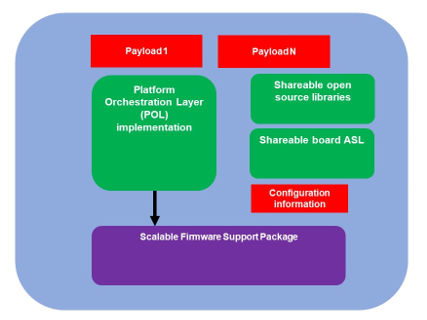
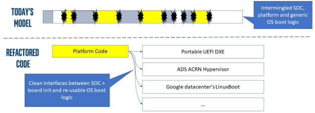
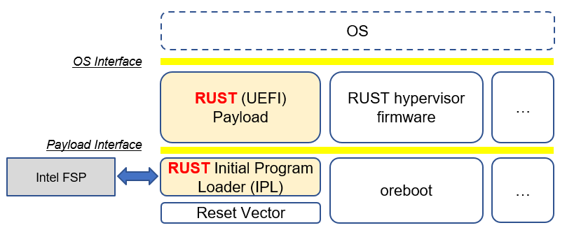
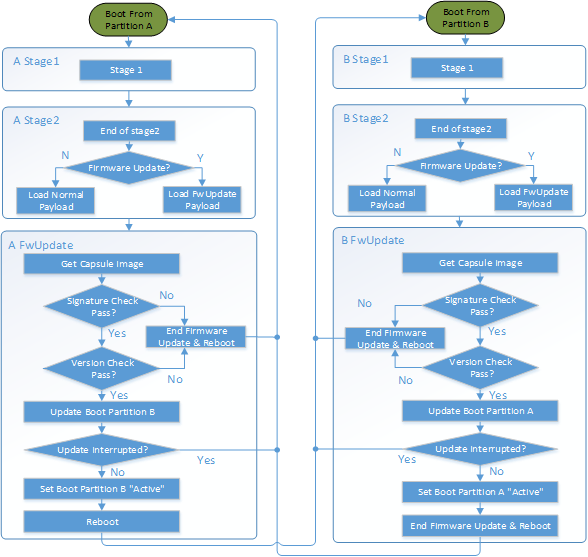

.. _platform-orchestration-layer-pol:

Platform Orchestration Layer (POL)
==================================

Introduction
------------

The Platform Orchestration Layer (POL) is aimed to provide guidelines on
writing platform code that leverage a Scalable Intel Firmware Support
Package (sFSP) interface and payload to coordinate the overall platform
initialization flow.

Motivation for POL
~~~~~~~~~~~~~~~~~~

Following the Next Generation Firmware initiative, the Intel system
firmware (BIOS) is evolving to be a multilayer, modular, scalable FW
solution which fulfills all the modern FW requirements in a super
complex HW IP centric world. The layers are shown in Figure 1.

The Platform Orchestration Layer sits between the SOC Abstraction Layer
(SAL), as abstracted by the Scalable FSP interface, and the Payload
Layer. The Platform Orchestration Layer coordinates the board-specific
boot sequence, invoking the sFSP interfaces for any silicon specific
work, and produces the interface to launch the payload environment along
with industry standard tables that are an amalgam of silicon and
platform, such as SMBIOS and ACPI.

.. image:: images/image3.png
   :width: 6.5in
   :height: 3.65625in

Figure 2 Layers of Universal Scalable Firmware

Therefore, the missions of POL layer are:

-  Initialize the board by programming board specific resources and
   invoking the sFSP for SOC and/or XPU specific resources

-  Invoke payloads for OS boot environment and possible XPU and runtime.

POL Design Principles
~~~~~~~~~~~~~~~~~~~~~

POL is considered as the layer for platform code. It plays a major role
in providing vendor specific features and mainboard-specific
initialization, as distinct from the sFSP that is scoped to be
SOC-specific. The POL will be the vehicle to convey policy into the
sFSP, interact with the sFSP for initialization, and retrieve state
information from the sFSP. The architectural design of a POL shall
follow the below principles:

-  Compatibility - POL shall be compliant with FSP Specification and
   provide the configuration information into the sFSP and retrieve
   resultant output information from the sFSP.

-  Portability – POL will attempt to be as SOC independent as possible
   and allow for source level compatibility between different open
   source platform code frameworks such as EDKII, coreboot, oreboot, and
   U-Boot. The OS boot specific code is abstracted via payloads.

-  Determinism/Simplicity – POL should abstract SOC initialization
   through sFSP interfaces and have a simple boot flow.

Audience / Document scope
~~~~~~~~~~~~~~~~~~~~~~~~~

The audience for this document is BIOS/system firmware architects and
developers that design or implement or consume Intel silicon
initialization code. The document is intended to describe the
architecture directions and requirements.

.. _terminology-1:

Terminology
~~~~~~~~~~~

.. _terminology_table:

**Table 1: Terminology**

======= ====================================
Term    Definition
======= ====================================
Config  Abstracted configuration information
Payload OS boot container
sFSP    SOC initialization
======= ====================================

Reference documents
~~~~~~~~~~~~~~~~~~~

The following documents are referenced in this specification.

.. _reference_documents:

**Table 2: Reference Documents**

+-----------------+-------------------------------------------------------------------------+-------------+
| Abbreviation    | Document                                                                | Version     |
+=================+=========================================================================+=============+
| FSP_EAS         | Intel® FSP External Architecture                                        | Version 2.2 |
|                 | Specification v2.2:                                                     | May 2020    |
|                 | https://cdrdv2.intel.com/v1/dl/getContent/627153                        |             |
+-----------------+-------------------------------------------------------------------------+-------------+
| PI_SPECS        | Platform Initialization                                                 | Version 1.4 |
|                 | Specification:                                                          |             |
|                 | http://www.uefi.org/sites/default/files/resources/PI_1_4.zip            | April 2015  |
|                 |                                                                         |             |
|                 | -  Volume I: PEI                                                        |             |
|                 |                                                                         |             |
|                 | -  Volume II: DXE CIS                                                   |             |
|                 |                                                                         |             |
|                 | -  Volume III: Shared Architecture                                      |             |
|                 |    Elements                                                             |             |
|                 |                                                                         |             |
|                 | -  Volume IV: SMM                                                       |             |
|                 |                                                                         |             |
|                 | -  Volume V: Standards                                                  |             |
+-----------------+-------------------------------------------------------------------------+-------------+
| UEFI_SPEC       | Unified Extensible Firmware                                             | Version 2.0 |
|                 | Interface Specification:                                                | April 2015  |
|                 | http://www.uefi.org/sites/default/files/resources/UEFI%202_5.pdf        |             |
+-----------------+-------------------------------------------------------------------------+-------------+
| FSP 2.3         | https://cdrdv2.intel.com/v1/dl/getContent/644852                        |             |
+-----------------+-------------------------------------------------------------------------+-------------+
| FSP Measurement | https://cdrdv2.intel.com/v1/dl/getContent/644001                        |             |
+-----------------+-------------------------------------------------------------------------+-------------+
|                 |                                                                         |             |
+-----------------+-------------------------------------------------------------------------+-------------+
| YAML config     | https://github.com/joshloo/fsp_yaml_cfg/tree/master/Tools/UserManuals   |             |
+-----------------+-------------------------------------------------------------------------+-------------+
| coreboot        | https://github.com/coreboot/coreboot                                    |             |
+-----------------+-------------------------------------------------------------------------+-------------+
| Oreboot         | https://github.com/oreboot/oreboot                                      |             |
+-----------------+-------------------------------------------------------------------------+-------------+
| Min platform    | https://www.tianocore.org                                               |             |
+-----------------+-------------------------------------------------------------------------+-------------+
| u-boot          | https://github.com/u-boot/u-boot                                        |             |
+-----------------+-------------------------------------------------------------------------+-------------+
| Slim bootloader | https://slimbootloader.github.io/                                       |             |
+-----------------+-------------------------------------------------------------------------+-------------+
| Payload         | https://github.com/universalpayload/documentation                       |             |
+-----------------+-------------------------------------------------------------------------+-------------+
| libspdm         | https://github.com/DMTF/libspdm                                         |             |
+-----------------+-------------------------------------------------------------------------+-------------+

Architecture
------------

The following section describes the architecture of the POL.

POL Overview
~~~~~~~~~~~~

Following the guiding principles in chapter 1.2, the high-level
architecture of POL is shown in Figure 2. POL interfaces with the sFSP
API specification, e.g. the 6 APIs and HOB/UPD defined in FSP 2.2 spec.
On the other end, POL interfaces with the universal payload. It should
invoke the payload API after providing board initialization.

Within the POL, it has several stages:

-  POL early initialization

   -  Maps to

      -  coreboot romstage

      -  EDKII SEC/PEI

      -  Slim bootloader stage 1

-  POL late initialization

   -  Maps to

      -  Coreboot ramstage

      -  Slim bootloader stage 2

      -  EDKII DXE

-  POL runtime

   -  OEM SMM

Figure 3 POL High Level Architecture

Another aspect of the POL is to allow for maximum platform code re-use
across different SOC generations.

.. image:: images/image5.PNG
   :alt: POL re-use
   :width: 6.36547in
   :height: 1.21892in

Figure 4 POL re-use

Beyond re-use of platform code with different SOC’s, the POL should be
re-useable across the most used or popular boot paradigms such as a full
UEFI boot, LinuxBoot, or an embedded hypervisor.

Figure 5 Different Payloads

The Universal Payload provides the right hand side interface. There
could be additional payloads, such as an XPU initialization payload or a
validation payload, such as FSP-V. But in either case the POL
implementation should be largely independent of the SOC and the payload.

Finally, UFS allows for a world where there are various compositions of
the firmware stack. This can include RUST-based firmware as either a
payload or the platform layer implementation, as described in the figure
below:

**Figure 6 Modern language-based usage**

This architecture is based upon https://github.com/jyao1/rust-firmware.

The rust API for FSP wrapper is at https://github.com/jyao1/rust-firmware/tree/master/rust-fsp-wrapper.

Configuration Introduction
--------------------------

| The Platform Orchestration Layer (POL) is aimed to provide guidelines
  on writing platform code that leverage a Scalable Intel Firmware
  Support Package (sFSP) interface and payload to coordinate the overall
  platform initialization flow. It needs to expose configuration, as do
  the layers below.
| To that end, YAML, which is a variant of JSON that allows for
  embedding comments, is employed in order to have a consisten

Platform configuration
~~~~~~~~~~~~~~~~~~~~~~

YAML based settings
^^^^^^^^^^^^^^^^^^^

Although the POL strives to be SOC independent, the system board’s SOC,
with its respective sFSP, and the usage of payloads, may require
different configuration. To that end, a consistent set of YAML based
configuration will be exposed to the system board builder and platform
user to configure the various elements.

YAML based configuration will be provided to abstract all of the
platform configurable elements

-  sFSP UPD

-  Platform configuration

   -  PCD/VFR for EDKII

   -  KConfig for coreboot/oreboot/u-boot

   -  DSC for slim bootloader

   -  YAML native for XPU payload

Example configuration
^^^^^^^^^^^^^^^^^^^^^

An example of an often configurable object for the platform developer is
GPIO.

An example of GPIO configuration is as follows:

- $ACTION :

page : GIO

- GPIO_CFG_DATA :

- !expand { CFGHDR_TMPL : [ GPIO_CFG_DATA, 0x400, 1, 0 ] }

- GPIO_CFG_HDR :

- GpioHeaderSize :

length : 0x01

value : \_LENGTH_GPIO_CFG_HDR\_

- GpioBaseTableId :

length : 0x01

value : 0xFF

- GpioItemSize :

length : 0x02

value : 8

- GpioItemCount :

length : 0x02

value : (_LENGTH_GPIO_CFG_DATA\_ - \_LENGTH_GPIO_CFG_HDR\_ - 8) / 8

# Bit start offset within each GPIO entry array to identify a GPIO pin
uniquely. EX: GPIO group id + pad id

# Offset is 2nd DWORD BIT16 = 1 \* 32 + 16 = 48

- GpioItemIdBitOff :

length : 0x01

value : 48

# Bit length within each GPIO entry array to identify a GPIO pin
uniquely.

# Length is 2nd DWORD BIT16 to BIT28 = 13

- GpioItemIdBitLen :

length : 0x01

value : 13

# Bit offset within each GPIO entry array to indicate SKIP a GPIO
programming

# Offset is 2nd DWORD BIT31 = 63

- GpioItemValidBitOff :

length : 0x01

value : 63

- GpioItemUnused :

length : 0x01

value : 0

# Need 1 bit per GPIO. So this mask byte length needs to be at least
(GpioNumber + 7) / 8

# Padding can be added to let the whole length aligned at DWORD boundary

- GpioBaseTableBitMask :

length : 38

value : {0}

- GpioTableData :

length : 0

value : 0

1.1.1 Example implementation
~~~~~~~~~~~~~~~~~~~~~~~~~~~~

An example of implementation in EDKII is Intel Seamless Board
Configuration (SBC). This feature provides a standardized and
centralized interface for various board HW configuration, including
GPIO, PCIe Clock, USB OC, DRAM, I2C, etc. The interface currently is
leveraging Structured PCD in VPD which allows both manually and tool
assisted modification for different HW setting in EDK2 Platform Payload.

SBC also supports multiple board configuration scenario with board
identifier mapped to SkuId in EDKII PCD.

.. image:: images/image8.png
   :width: 4.4375in
   :height: 2.86458in

Figure 6 Board configuration

Example implementation with Structured PCD:

gBoardModuleTokenSpaceGuid.VpdPcdBoardGpioTable|*|{CODE({

| {GPIO_PIN_1, {GpioSettingA,GpioSettingB, GpioSettingC, ...}},
| {GPIO_PIN_2, {GpioSettingA,GpioSettingB, GpioSettingC, ...}},
| …

{0x0} // terminator

})}

Components in EDKII Bootloader will consume these HW configuration while
the configuration data is already selected based on SkuId during POST.
Then these setting will be applied into silicon or board HW via sFSP.
Necessary information will also be wrapped and passed to OS, such as
GPIO related setting in ACPI Table.

Shareable platform code
~~~~~~~~~~~~~~~~~~~~~~~

For the platform implementation, there are two means of code sharing.
One way to share content is via binary universal payloads, and the other
is via source code.

TBD – example source code. Cite moving of PciBus DXE driver to slim
bootloader stage 2 code

OpenSPDM example as source code for sharing across POL implementations.

Advanced features represent a set of platform technologies that are not
needed for basic boot. These features provide a way to extend the
platform firmware capabilities.

For these features to be sharable and extensible, they must adopt a
high-cohesive, low-coupling design. This means an advanced feature
should be mostly self-contained and expose a set of well defined
interfaces that can be called by components outside the feature scope.

An advanced feature should not directly depend on another advanced
feature. Such a dependency should be resolved via an integration layer
(e.g. Board layer). The following represents a high level design of
Advanced Features.

+-------------+
| AFP1        |
+=============+
| AFP2        |
+-------------+
| AFP3        |
+-------------+
| AFP4        |
+-------------+
| Board Layer |
+-------------+

Advanced feature details 
~~~~~~~~~~~~~~~~~~~~~~~~

The low-level design and implementation of Advanced feature may vary
based on boot loaders and other preferences.

The EDKII Min Platform boot loader follows a rich set of design
guidelines conforming EDKII software framework and UEFI specification.

Examples of construction of a Min Platform can be found at
https://github.com/tianocore/edk2-platforms/blob/master/Platform/Intel/MinPlatformPkg/Docs/A_Tour_Beyond_BIOS_Open_Source_IA_Firmware_Platform_Design_Guide_in_EFI_Developer_Kit_II%20-%20V2.pdf

Shareable platform code - definition
^^^^^^^^^^^^^^^^^^^^^^^^^^^^^^^^^^^^

+In this specification, the shareable platform code focuses on **source
code sharing**. Binary sharing should be considered in scalable FSP.

1. The shareable platform code SHALL be reusable by multiple
   bootloaders, including but not limited, to EDKII, slim bootloader,
   coreboot.

2. The shareable platform code SHOULD be reusable across different boot
   phase, such as EDKII PEI/DXE/SMM phase, the coreboot ROM/RAM stage.
   This highly depends upon the use case.

3. The shareable platform code MAY be used for other firmware. For
   example, the `libspdm <https://github.com/DMTF/libspdm>`_ library may be used for system firmware, BMC
   firmware, or even device firmware. It also depends upon the use case
   – if there is business need for sharing.

Shareable platform code - guideline
^^^^^^^^^^^^^^^^^^^^^^^^^^^^^^^^^^^

1. Don’t consume any boot load specific API. For example, UEFI boot
   services, PCI IO Protocol.

2. Don’t consume standard C library. Not all boot load includes standard
   C library.

3. Use static link library if possible. Don’t use dynamic link library.

4. Use heap carefully. Some environment might not have heap.

5. Use global variable carefully. Some environment may only support
   read-only variable because the code runs on the flash.

6. Don’t use inline assembly. Some build environment may not support
   inline assembly.

7. Another guideline is to not expose internal function in public header
   file. The internal header file should be hidden.

8. Define the boot loader provided library dependency clearly, such as
   Hardware Abstract Layer (HAL). It can make library porting easier.

9. Define the boot loader caller provided function dependency clearly,
   such as a callback function.

Shareable platform code – RUST binding API
^^^^^^^^^^^^^^^^^^^^^^^^^^^^^^^^^^^^^^^^^^

1. Include length parameter for any buffer.

2. Have single owner for one buffer. If the caller allocates the buffer,
   the caller shall free the buffer.

3. Define the contract between the caller and callee. E.g. If the input
   buffer is trusted or untrusted?

4. Define the error behavior clearly. Return? Deadloop? Assert?

Interface definitions
~~~~~~~~~~~~~~~~~~~~~

Shareable platform code APIs 
^^^^^^^^^^^^^^^^^^^^^^^^^^^^

Min Platform Advanced Feature Packages (AFP) in EDKII, coreboot 3rd party directory code
''''''''''''''''''''''''''''''''''''''''''''''''''''''''''''''''''''''''''''''''''''''''

Provide example of the Pci enumeration code/library

Show the generic code such as sharable `libspdm <https://github.com/DMTF/libspdm>`_

Shareable board ASL
^^^^^^^^^^^^^^^^^^^

TBD
'''

Shareable platform code APIs – Rust bindings
^^^^^^^^^^^^^^^^^^^^^^^^^^^^^^^^^^^^^^^^^^^^

A Rust library can be created on top of C - API. For example:

 * `rust-openssl <https://github.com/sfackler/rust-openssl>`_ is a Rust binding for `openssl <https://www.openssl.org/>`_ library.

 * `rust-mbedtls <https://github.com/fortanix/rust-mbedtls>`_ is a Rust binding for `mbedtls <https://tls.mbed.org/>`_ library.

In firmware, we have below example:

 * `r-efi <https://github.com/r-efi/r-efi>`_ defines a set of Rust style UEFI data structure.

 * `uefi-rs <https://github.com/rust-osdev/uefi-rs>`_ provides a set of UEFI services interface in Rust.

 * `rust-fsp-wrapper <https://github.com/jyao1/rust-firmware/tree/master/rust-fsp-wrapper>`_ provides a set of Intel FSP APIs for the FSP wrapper.

XPU considerations
------------------

One of the goals of the USF effort is to help support all classes of
silicon , namely XPU’s. An XPU can be a CPU, such as the SOC based upon
Intel Core, Intel Atom, RISC-V or ARM. In addition, the XPU can include
integrated or discrete graphics (iGFX/dGFX), FPGA, AI, networking, or
acceleration.

To that end, there are various aspects of the XPU support.

These include configuration, update, monitoring, and access, both during
the pre-OS and at OS runtime. In the future the latter may move into
level 0, but for now the USF shall treat these.

Like other aspects of USF, XPU considerations are in the POL
specification since the platform is where all of the system components
come together.

Configuration
~~~~~~~~~~~~~

To configure the XPU, a canonical YAML based configuration file will be
provided.

Build time
^^^^^^^^^^

Post ship
^^^^^^^^^

Pre-OS
''''''

Runtime
'''''''

Initialization
~~~~~~~~~~~~~~

Initialization can include having the XPU as part of the sFSP, a
dedicated payload, a UEFI or legacy BIOS option ROM, or some open source
POL portable library.

Open source portable initialization code
^^^^^^^^^^^^^^^^^^^^^^^^^^^^^^^^^^^^^^^^

Dedicated payload 
^^^^^^^^^^^^^^^^^

Option ROM (e.g., dGFX or networking HBA)
^^^^^^^^^^^^^^^^^^^^^^^^^^^^^^^^^^^^^^^^^

sFSP element (e.g., iGFX in Core CPUs)
^^^^^^^^^^^^^^^^^^^^^^^^^^^^^^^^^^^^^^

Update
~~~~~~

It is critical to support both the factory time integration of the XPU
support into the IFWI and/or post ship update of XPU support code.

Slim bootloader update payload
^^^^^^^^^^^^^^^^^^^^^^^^^^^^^^

Overview
''''''''

SBL embedded a built-in Firmware Update (FWU) payload to perform a
secure and power fail-safe firmware update flow. It contains redundant
boot partitions and depends on hardware assisted boot partition switch
to support fail-safe update.

SBL provides abstracted ACPI/WMI interface to trigger FWU flow, EDK2
similar capsule update mechanism to pass the new firmware to bootloader,
and EDK2 similar way to report the FWU status back to OS through ACPI
table.

Firmware Update Flow
''''''''''''''''''''

SBL firmware update flow utilizes redundant boot partition to perform
firmware update in a reliable way. It involves the following high-level
steps:

-  Boot from Partition A

-  Update Partition B

-  Activate Partition B

-  Reboot

-  Boot from Partition B

-  Update Partition A

-  Activate Partition A

-  Reboot

-  Report Firmware Update status

-  Terminate firmware update flow.

-  Reset system to continue booting to operating system.

Below is a detailed FWU flow chart for SBL.

Figure 7

-  Firmware Update capsule is copied to designated location. This
   location is configurable through SBL configuration options.

-  Firmware update is triggered from SBL shell or from Operating system
   and followed by a system reset.

-  SBL detects firmware update signal and sets platform into firmware
   update mode.

-  SBL identifies firmware update mode and loads firmware update payload
   to start update flow.

-  Firmware Update payload gathers capsule image from selected media and
   verifies capsule data. If successful, continues with firmware update.

-  Firmware update payload initializes state machine and identifies the
   update images in the capsule.

-  FWU payload loops through and updates each firmware identified in the
   capsule image.

-  FWU records update status after each firmware update.

-  If the firmware is requesting reset after update, reset the system to
   continue updating other firmware in the capsule.

-  In case of a power failure, FWU payload will use the state machine
   stored in flash to resume from the interrupted state.

Firmware Update Triggering
''''''''''''''''''''''''''

SBL provides a platform independent abstracted way of triggering
firmware update from operating system through ACPI or WMI interfaces.

SBL provides common ACPI methods, DWMI.WQ00 for read and DWMI.WS00 for
write to a platform specific chipset register that can survive a reset
to signal firmware update. This ACPI method can be called by driver or
application to request triggering a firmware update. On the following
reboot flow, once the firmware update signal is detected, this signal
will be stored into flash so that the following firmware update flow can
resume in case of a power failure in the middle of the process.

For OS that supports WMI, such as Windows, SBL further exposes
AcpiFirmwareCommunication WMI service through ACPI table to allow
triggering firmware updates directly using WMI from applications.

Firmware Update Status
''''''''''''''''''''''

SBL reports firmware update status through custom defined Firmware
Update status (FWST) ACPI table. FWST ACPI table will be available as
part of RSDT and can be identified with a table signature “FWST”. FWST
ACPI table makes use of EFI_SYSTEM_RESOURCE_TABLE defined in UEFI
specification to report firmware update status. It adds additional ACPI
header on top of it to make it conform to ACPI speciation. OS can use
this ACPI table to retrieve the previous firmware update information.

UEFI capsule update
^^^^^^^^^^^^^^^^^^^

AB update of payload for coreboot
^^^^^^^^^^^^^^^^^^^^^^^^^^^^^^^^^

Monitoring
~~~~~~~~~~

The ability to ascertain status of the platform and XPU’s has various
modalities.

UEFI tables
^^^^^^^^^^^

ACPI
^^^^

POL examples
------------

This chapter gives a reference implementation of POL under EDKII
framework. Below shows the code layout that POL has a dedicated package
to hold all POL related code.

Slim bootloader
~~~~~~~~~~~~~~~

Slim Bootloader (SBL) is a flexible, lightweight, and open-source
reference boot loader solution designed for Intel platforms. SBL is
architected with a modular approach by providing very basic hardware
initialization in bootloader, then launching a payload to boot to final
OS or application. The payload is flexible and can be at user’s choice
to meet special needs. The SBL overall architecture is shown in the
diagram below:

.. image:: images/image10.png
   :width: 6.36458in
   :height: 2.10417in

Figure 8: SBL Architecture

SBL takes a linear staged boot approach to initialize the platform. As
illustrated in the diagram below, in each stage, SBL utilizes Intel® FSP
API interfaces to initialize the silicon and utilizes static library
interfaces to initialize the board. 

**Figure 9: SBL Linear Staged Boot Approach**

These static library interfaces are aligned with EDK2 base library implementation to the abstract board initialization API. For examples, see Figure 9 above and GPIO initialization, ACPI
initialization, etc.

The detailed SBL stages are listed in the table below:

+----------+----------------------------------------------------------+
| Stage    | Description                                              |
+==========+==========================================================+
| Stage 1A | Stage 1A contains reset vector and is first stage to     |
|          | gain control. It is responsible for very basic platform  |
|          | execution environment initialization to enable following |
|          | stage execution. It includes temporary memory, debug     |
|          | port, etc.                                               |
+----------+----------------------------------------------------------+
| Stage 1B | Stage 1B is the “pre-memory” stage and is responsible    |
|          | for loading configuration data and initialization system |
|          | main memory. After memory is available, it will load and |
|          | verify Stage2 for execution.                             |
+----------+----------------------------------------------------------+
| Stage 2  | Stage 2 is the “post-memory” stage and is responsible    |
|          | for all initialization the remaining platform, including |
|          | chipset, CPU, I/O, ACPI, PCI, etc.                       |
+----------+----------------------------------------------------------+
| Payload  | Payload is the bridge between bootloader and the OS. It  |
|          | provides standard boot device initialize to further      |
|          | load, verify and launch OS images. It also performs      |
|          | specific actions, such as firmware update.               |
+----------+----------------------------------------------------------+

As stated above, SBL utilizes static library class to abstract the API
interfaces for platform initialization. These libraries are written in
pure C language so that it can easily be shared between different boot
solutions. For example, many base library instances in EDK2 MdePkg are
directly leveraged by SBL. Many other libraries, such as SoC access
libraries, feature libraries are also ported from corresponding EDK2
libraries through removing UEFI specific dependencies. In addition, ACPI
ASL files are also borrowed from EDK2 directly. These sharable libraries
and files make it easier to quickly enable a platform using the boot
solution at user’s choice.

.. image:: images/image12.png
   :width: 5in
   :height: 3.03125in

u-boot
~~~~~~

U-Boot can be fabricated as a POL or a payload.

Oreboot
~~~~~~~

Oreboot is a RUST-based POL example

coreboot
~~~~~~~~

coreboot is a POL example

EDKII
~~~~~

| EDKII can be used to create an FSP, such as
  https://github.com/tianocore/edk2/tree/master/IntelFsp2Pkg described in https://www.intel.com/content/dam/develop/public/us/en/documents/a-tour-beyond-bios-creating-the-intel-firmware-support-package-with-the-efi-developer-kit-ii-fsp2-0.pdf
| EDKII can also be a POL, including the MinPlatform
  https://github.com/tianocore/edk2-platforms/blob/master/Platform/Intel/Readme.md.

EDKII can also be used to create a payload, such as
https://github.com/tianocore/edk2/tree/master/UefiPayloadPkg.

Components
^^^^^^^^^^

Components in EDKII based firmware can be separated into three
categories:

-  EDKII Bootloader

-  UEFI Universal Payload

-  EDKII UEFI Platform Payload (Optional)

**Figure 10**

The system boot starts from EDKII Bootloader where the FSP is invoked to
initialize the silicon. Then the Bootloader follows the Payload
specification to load and start UEFI Universal Payload. It may pass
additional FV location information to UEFI Universal Payload which tells
the optional EDKII UEFI Platform Payload.

EDKII Bootloader consists of reset vector code, necessary platform
specific code and EDKII generic code that launches FSP. In the end of
EDKII Bootloader, it transfers the control from EDKII Bootloader to UEFI
Universal Payload through DxeIpl PEIM. Each platform vendor develops its
EDKII Bootloader and the implementations for different platforms are
different.

UEFI Universal Payload consists of all the platform agnostic drivers
that prepare the UEFI OS booting environment. For example, the RTC
driver to support UEFI time services, the MTC driver to support the UEFI
Monotonic Counter services. The “Universal” in the name stands for the
goal that the same payload binary can be used by different bootloaders
and different platforms. There is only one implementation instance of
the UEFI Universal Payload. For example, Slim bootloader and EDKII
Bootloader can boot to UEFI OS by using the same UEFI Universal Payload.
All the SOC and platform specific information is abstracted in EDKII
Bootloader and passed to UEFI Universal Payload. The abstraction format
is defined by Payload specification.

EDKII UEFI Platform Payload is an optional component. It consists of
platform specific implementations:

.. image:: images/image14.png

that must be done in payload phase.

Theoretically this component can be eliminated by moving all
implementations to EDKII Bootloader.

Figure 11

Data Flow
^^^^^^^^^

EDKII Bootloader passes SOC and platform information through HOBs to
UEFI Universal Payload. UEFI Universal Payload interacts with EDKII UEFI
Platform Payload through Protocols. EDKII Bootloader can use any
mechanism to pass information to EDKII UEFI Platform Payload since both
are owned by the platform vendor.

.. image:: images/image15.png
   :alt: Universal Payload, UEFI Platform Payload, and EDKII Bootloader
   :width: 6.5in
   :height: 2.86319in

**Figure 12: Universal Payload, UEFI Platform Payload, and EDKII Bootloader**

