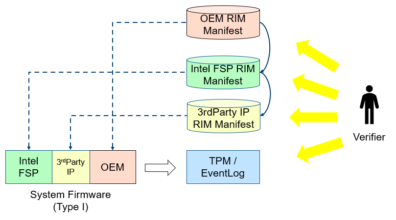
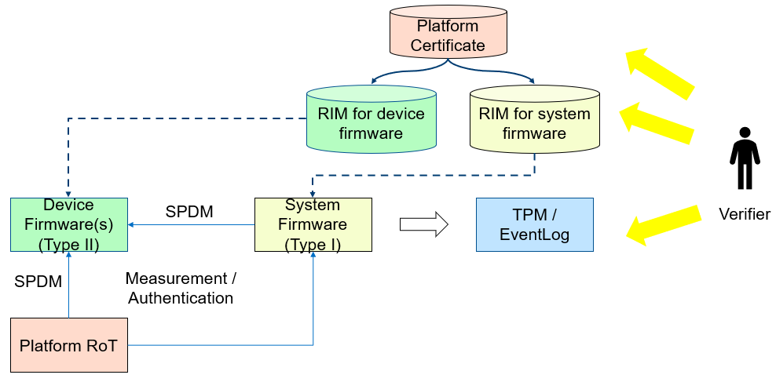

.. _security:

Security 
========

Security Overview
-----------------

There are various security considerations for the POL, sFSP, and the
payloads. This section will describe the various overall concerns and
technology specific aspects.

Firmware Resiliency - Protection
~~~~~~~~~~~~~~~~~~~~~~~~~~~~~~~~

Critical Resource Lock (hardware)
^^^^^^^^^^^^^^^^^^^^^^^^^^^^^^^^^

The platform shall always lock the important resource before it exits
the platform manufacture phase.

The important resource includes but is not limited to flash part, SMRAM,
SMRR, silicon register such as lockable BAR register,

Critical Service Close (software)
^^^^^^^^^^^^^^^^^^^^^^^^^^^^^^^^^

The platform shall always close the service that may impact the system
resource.

The service includes but is not limited to SMM registration service,
flash update service.

Critical Resource Access
^^^^^^^^^^^^^^^^^^^^^^^^

The platform shall only allow the critical resource access in the
trusted execution environment such as SMM.

.. _update-1:

Update
^^^^^^

The platform shall only allow firmware update only in the trusted
execution environment such as SMM, or before existing the platform
manufacture phase.

The update must check the secure version number to prevent rollback.

Firmware Resiliency - Detection
~~~~~~~~~~~~~~~~~~~~~~~~~~~~~~~

Secure Boot (verified boot)
^^^^^^^^^^^^^^^^^^^^^^^^^^^

The platform shall enable secure boot. The early boot component shall
verify the next component.

Care must be taken for Time-of-check/Time-of-use (TOC/TOU) attack.

The early component shall copy the next component to a trusted execution
environment, verify and use.

Please refer to `Understanding the UEFI Secure Boot Chain <https://tianocore-docs.github.io/Understanding_UEFI_Secure_Boot_Chain/draft/>`_

Secure Configuration (data verification)
^^^^^^^^^^^^^^^^^^^^^^^^^^^^^^^^^^^^^^^^

If the configuration has security property, such as lock/unlock policy.
It shall be protected and verified.

The secure configuration may be treated as code and verified together
with secure boot.

Or the secure configuration may be protected by the variable
enhancement, such as RPMB or RPMC.

Firmware Resiliency - Recovery
~~~~~~~~~~~~~~~~~~~~~~~~~~~~~~

Recovery trigger
^^^^^^^^^^^^^^^^

A platform should have a watchdog to auto trigger recovery process
automatically. Otherwise, it should notify the end user that a manual
recovery is required.

Known good image
^^^^^^^^^^^^^^^^

The recovery process may load a known good image. The known good image
itself shall be protected and follow the detection flow.

The known good image shall be up to date as well, to resist rollback
attack – recovery to an old known bad image.

Measurment and Attestation
~~~~~~~~~~~~~~~~~~~~~~~~~~

OEM Component Measurement
^^^^^^^^^^^^^^^^^^^^^^^^^

The platform shall follow `TCG PC Client Platform Firmware Profile <https://trustedcomputinggroup.org/resource/pc-client-specific-platform-firmware-profile-specification/>`_
if TPM-based measured boot is enabled. The early boot component shall
measure the next component before transfer control to it, to create a
trust chain.

Please refer to `Understanding the Trusted Boot Chain Implementation <https://tianocore-docs.github.io/edk2-TrustedBootChain/release-1.00/edk2-TrustedBootChain-release-1.00.pdf>`_

The platform shall follow TCG specification to measure all required
component. For example, the platform shall measure every boot component.
The platform shall measure any security-related boot configuration.

FSP Measurement
^^^^^^^^^^^^^^^

The platform shall follow `FSP measurement and attestation <https://cdrdv2.intel.com/v1/dl/getContent/644001>`_
to record the measurement for FSP binary.

Device Measurement
^^^^^^^^^^^^^^^^^^

The platform shall follow `DMTF Security Protocol and Data Model (SPDM) Specification <https://www.dmtf.org/dsp/DSP0274>`_
to record the measurement for the devices.

Universal Payload Measurement
^^^^^^^^^^^^^^^^^^^^^^^^^^^^^

The platform shall create a standalone event log for the universal payload.

     .. list-table::
        :widths: auto
        :header-rows: 1
        
        * - Component
          - PCR
          - Event Type
          - Event Data
          - Event Log
        * - UniversalPayload binary
          - 0 (if it is part of OEM binary) or 2 (if it is treated as second phase loader)
          - EV_EFI_PLATFORM_FIRMWARE_BLOB2
          - UniversalPayload binary
          - EFI_PLATFORM_FIRMWARE_BLOB2 structure (descriptor: "UniversalPayload")

DMA Protection
~~~~~~~~~~~~~~

The platform shall enable IOMMU based DMA protection.

For example, `Using IOMMU for DMA Protection in UEFI Firmware <https://software.intel.com/sites/default/files/managed/8d/88/intel-whitepaper-using-iommu-for-dma-protection-in-uefi.pdf>`_.

Cryptography Agility
~~~~~~~~~~~~~~~~~~~~

A firmware infrastructure shall allow the implementation to choose different cryptographic algorithms, to compliant with different standards. This is called Cryptography agility.
TPM2.0 standard is a good example. A TPM2.0 device may support SHA256, SHA384, SM3_256, or future algorithms such as SHA3_256 or SHA3_384.

Below table shows the supported crypto algorithms.

     .. list-table::
        :widths: auto
        :header-rows: 1
        
        * - Standard
          - Supported Algorithm
        * - TCG - `EFI Protocol <https://trustedcomputinggroup.org/resource/tcg-efi-protocol-specification/>`_
          - SHA1/SHA-{256,384,512}/SM3
        * - IETF - `TLS 1.3 <https://datatracker.ietf.org/doc/rfc8446/>`_
          - TLS Cipher Suite – for negotiation
        * - DMTF - `SPDM 1.1 <https://www.dmtf.org/sites/default/files/standards/documents/DSP0274_1.1.1.pdf>`_
          - RSA{SSA,PSS}_{2048,3072,4096}/ECDSA_P{256,384,521}+{SHA,SHA3}_{256,384,512}
        * - PCI-SIG – `CMA (Component Measurement and Authentication) <https://pcisig.com/specifications>`_
          - RSASSA_3072/ECDSA_P{256,384} + SHA{256,384}
        * - UEFI - `UEFI 2.9 <https://uefi.org/sites/default/files/resources/UEFI_Spec_2_9_2021_03_18.pdf>`_
          - RSA2048 (PKCS1_1.5) + SHA256

Below table shows the minimal requirement.

     .. list-table::
        :widths: auto
        :header-rows: 1
        
        * - Standard
          - Minimal Requirement
        * - `Commercial National Security Algorithm Suite (CNSA Suite Guide) <https://apps.nsa.gov/iaarchive/programs/iad-initiatives/cnsa-suite.cfm>`_
          - SHA384, RSAPSS_3072/ECDSA_P384
        * - `PRC CESA Server BIOS Requirement <https://www.cesa.cn/news.aspx?id=bgHZbw0110I=&t=%E9%80%9A%E7%9F%A5%E5%85%AC%E5%91%8A>`_
          - SHA256/SM3, RSA_2048/SM2, ECDSA_256/SM2
        * - `ARM Trusted Board Boot Requirements Client (TBBR-CLIENT) for A profile <https://developer.arm.com/documentation/den0006/latest>`_
          - AES_128, SHA256, ECDSA_256 (RSAPSS_2048)
        * - `ARM Platform Security Architecture (PSA) Trusted Base System Architecture (TBSA) for M profile <https://developer.arm.com/-/media/Arm%20Developer%20Community/PDF/PSA/DEN0083_PSA_TBSA-M_1.0-bet2.pdf?revision=95776bd7-b790-48f0-bb18-ee064fb381ad>`_
          - AES_128, SHA256, ECDSA_256, RSA_3072
        * - `OCP Secure Boot <https://docs.google.com/document/d/1Se1Dd-raIZhl_xV3MnECeuu_I0nF-keg4kqXyK4k4Wc/edit#heading=h.5z2d7x9gbhk0>`_
          - SHA384, RSAPSS_3072/ECDSA_P384

Below table shows the algorithm usage.

     .. list-table::
        :widths: auto
        :header-rows: 1
        
        * - Feature
          - Algorithm
        * - `coreboot – Google Binary Blob (GBB) firmware keys <https://link.springer.com/chapter/10.1007/978-1-4842-0070-4_5>`_
          - RSA 8192 + SHA512
        * - `IBM Power Secure Boot <https://developer.ibm.com/technologies/linux/articles/protect-system-firmware-openpower/>`_
          - ECDSA (512 bit) + SHA512
        * - `MSFT Secure Boot Key <https://docs.microsoft.com/en-us/windows-hardware/manufacture/desktop/windows-secure-boot-key-creation-and-management-guidance#12-public-key-cryptography>`_
          - RSA 2048 + SHA256

A firmware infrastructure shall consider crypto-agile support for two purposes:

1. To support more industry standard cryptographic algorithms, which may be used in some firmware implementation, such as SHA3, SM3, SM2, etc.
2. To support quantum safe cryptographic algorithm and hybrid mode, such as XMSS or LMS digital signature algorithm, etc.

Vulnerability Mitigation Strategy
---------------------------------

The platform should make the attacker difficult to find, exploit and leverage the vulnerabilities.

     .. list-table::
        :widths: auto
        :header-rows: 1
        
        * - Tactics
          - Method
          - Example
        * - Eliminate Vulnerability 
          - Reduce Attack Surface. Dont Use Weak Cryptography Algorithm. Use Type Safe Programming Language.
          - Remove Unnecessary Interface, such as SMI handler, UEFI variable. Adopt Firmware Security Best Practice. Consider Side Channel Attack. Cryptography Agility. Use Rust.
        * - Break Exploitation
          - Data Execution Prevention. Control Flow Guard. Address Space Layout Randomization. Secure Boot.
          - Non-executable Data Page. Read-only code page. Stack Cookie. Intel CET. ASLR in DXE/SMM.
        * - Contain Damage
          - Deprevilege
          - Ring-3 Option ROM. Ring-3 OEM SMM.
        * - Limit Attack Window
          - Firmware Resiliency. Measurement and Attestation.
          - Live Patching Runtime Component. Firmware Component Manifest.

Eliminate Vulnerability
~~~~~~~~~~~~~~~~~~~~~~~

First, a platform should try to remove any attack surfaces and eliminate the potential vulnerablity.

Minimize SMI handler
^^^^^^^^^^^^^^^^^^^^

In a system firmware, the SMI Handler is the most critical attack surface, because the SMM code has highest privilege. A platform should use `SMI Handler Profile <https://github.com/tianocore/tianocore.github.io/wiki/SMI-handler-profile-feature>`_ to evaluate if the exposed SMI handlers are necessary.

Minimize UEFI variable
^^^^^^^^^^^^^^^^^^^^^^

Every UEFI variable is an attack surface, because the attacker can use UEFI API to modify it. A platform should review all UEFI variable and evaluate if it is really needed.

Adopt Firmware Security Best Practice
^^^^^^^^^^^^^^^^^^^^^^^^^^^^^^^^^^^^^

The platform should follow the existing firmware security best practice, such as `EDKII Secure Design Guide <https://github.com/tianocore-docs/Docs/raw/master/White_Papers/A_Tour_Beyond_BIOS_Security_Design_Guide_in_EDK_II.pdf>`_, `EDKII Secure Coding Guide <https://tianocore-docs.github.io/EDK_II_Secure_Coding_Guide/draft/>`_, `EDKII Secure Code Review Guide <https://tianocore-docs.github.io/EDK_II_Secure_Code_Review_Guide/draft/>`_.

Other EDKII security related document can be found at `EDKII Security White Papers <https://github.com/tianocore/tianocore.github.io/wiki/EDK-II-Security-White-Papers>`_.

Consider Side Channel Mitigation
^^^^^^^^^^^^^^^^^^^^^^^^^^^^^^^^

A platform shall follow `Host Firmware Speculative Execution Side Channel Mitigation <https://www.intel.com/content/www/us/en/developer/articles/technical/software-security-guidance/technical-documentation/host-firmware-speculative-side-channel-mitigation.html>`_.

1. LFENCE after validation of untrusted data but before use
2. RSB stuffing before RSM

Type Safe Programming Language
^^^^^^^^^^^^^^^^^^^^^^^^^^^^^^

An analysis has found that 50% of the open source BIOS security bugs are due to buffer overflows and integer overflows. There are a variety of tools and techniques to prevent these bugs, by identifying and eliminating the vulnerability or by ensuring the vulnerability is not exploitable. Alternatively, instead of providing an ever-increasing set of guidance and tools to address these bugs, we could seek ways to avoid introducing the bugs in the first place.  An emerging approach is to use memory-safe programming languages.  

`Rust <https://www.rust-lang.org/>`_ is a promising new programming language that can eliminate memory safety issues at compile time. Engineers at Microsoft have made a `case <https://msrc-blog.microsoft.com/2019/07/16/a-proactive-approach-to-more-secure-code/>`_ for using memory-safe languages like Rust. A number of firmware and embedded projects are embracing Rust, including `oreboot <https://github.com/oreboot/oreboot>`_ system firmware, RISC-V `rustsbi <https://github.com/rustsbi/rustsbi>`_ and `tock <https://github.com/tock/tock>`_ embedded OS. Rust also supports UEFI toolchains, x86-64-unknown-uefi and i686-unknown-uefi, which can be used to generate a UEFI executable directly. There are UEFI related Rust projects including `r-efi <https://github.com/r-efi/r-efi>`_ and `uefi-rs <https://github.com/rust-osdev/uefi-rs>`_. 

EDKII firmware may use Rust to build a component with `RustPkg <https://github.com/jyao1/edk2/tree/edkii-rust/RustPkg>`_. A lightweight pure `rust-firmware <https://github.com/jyao1/rust-firmware>`_ is also possible to boot the system with Intel FSP.

.. image:: images/image7.png
   :width: 5in
   :height: 2.8125in

**Figure 14 A pure Rust-firmware**

Experimentation so far has shown that, with compile-time checking, Rust can eliminate uninitialized variable, use after free, and double free vulnerabilities.  With runtime checking, Rust can help break exploitation of memory boundary check and integer overflow check issues.

In addition to memory safety benefits, Rust also has good software engineering tools support and is interoperable with C.  With Rust, developers can easily generate documents (cargo doc), perform unit tests (cargo test), fix coding style issues (cargo fmt), do static analysis (cargo clippy), and more.  All those tools are integrated into the Rust cargo package manager. Rust can even get faster performance than C because the code can be determined at compile time, saving time at runtime execution.

Break Exploitation
~~~~~~~~~~~~~~~~~~

If a platform may contain the vulnerablities, the platform should adopt defence in deptch to break the exploitation. `Memory Protection in UEFI BIOS <https://edk2-docs.gitbook.io/a-tour-beyond-bios-memory-protection-in-uefi-bios>`_, `Mitigate Buffer Overflow in UEFI <https://tianocore-docs.github.io/ATBB-Mitigate_Buffer_Overflow_in_UEFI/draft/>`_, `Secure SMM Communication <https://github.com/tianocore-docs/Docs/raw/master/White_Papers/A_Tour_Beyond_BIOS_Secure_SMM_Communication.pdf>`_, and `CET in SMM <https://github.com/tianocore/tianocore.github.io/wiki/CET-in-SMM>`_ provides guideline on how to mitigate those threats.

Data Execution Prevention (DEP)
^^^^^^^^^^^^^^^^^^^^^^^^^^^^^^^

A platform should set data memory to be non-executable and code memory to be read-only. As such, the data page (including stack, heap, global data, and usable memory) cannot be executed. It is an efficient way to prevent code injection.

Control Flow Guard (CFG)
^^^^^^^^^^^^^^^^^^^^^^^^

Control flow attack is feasiable even if the DEP is enabled. A platform may enable compiler feature (stack cookie) or use the CPU feature such as Intel Control Flow Enforcement Technology (CET) to guard the control flow.

Address Space Layout Randomization (ASLR)
^^^^^^^^^^^^^^^^^^^^^^^^^^^^^^^^^^^^^^^^^

ASLR is makes it more difficult for an attacker to predict target addresses even if there is vulnerability in the program. The randomization technology can include shuffling, most likely for the image, or shifting, most likely for the data.

Contain Damage
~~~~~~~~~~~~~~

If a platform does not have an efficient way to break the exploitation, the platform may consider to limit the damage in a small scope.

Deprevilege Execution
^^^^^^^^^^^^^^^^^^^^^

By default, the system firwmare execution environment is in ring-0. Platform may run untrusted component in a deprevileged environment ring-3.

For example, the UEFI firmware can run 3rd party option ROM in ring-3, a small SMM CPU code can run the OEM SMM driver in ring-3, etc.

If the vulnerabilities in option ROM or OEM SMM code are exploited, the damage will only be in the ring-3 component and will not impact the system.

Limit Attack Window
~~~~~~~~~~~~~~~~~~~

If a platform really has vulnerablity escaping from all defense and impact the system, we need patch it platform in time.

Live Patching
^^^^^^^^^^^^^^

Live patching is trend in the industry. For example, Linux kernel implemented live patching of a running kernel.

The system firmware may consider using similar mechanims to patch the runtime component if there is.

Firmware Component Manifest
^^^^^^^^^^^^^^^^^^^^^^^^^^^

Before a firmware patch is deployed, an adiminstrator may need to know how many systems are impacted.

A platform may include many firmware components, which are from different sources. Now we need a way to collect those information. We define 2 category of firmwares in below table

     .. list-table::
        :widths: auto
        :header-rows: 1
        
        * - Type
          - Sub-Type
          - Loader (Loaded/Measured/Authenticated by)
          - Location (Loaded from)
          - Execution Environment (Executed in)
          - Example
        * - Type-I
          - I-A
          - Host
          - System Firmware
          - Host
          - BIOS, Intel FSP, CPU Microcode
        * - Type-I
          - I-B
          - Host
          - Peripheral Device
          - Host
          - PCI Option ROM
        * - Type-II
          - II-A
          - Non-Host
          - Non-Host Firmware
          - Non-Host
          - BMC, EC, Intel CSME
        * - Type-II
          - II-B
          - Peripheral Device
          - Peripheral Device
          - Peripheral Device
          - NIC, NVMe, Graphic Card

We define 2 types of firmwares:

 * Type-I firmware indicates the firmware loaded, measured, authenticated in host environment.
    * Type-I-A indicates the one loaded from system firmware location, such as BIOS, FSP, CPU Microcode.
    * Type-I-B indicates the one loaded from peripheral device, such as PCI option ROM.
 * Type-II firmware indicates the firmware loaded, measured, authenticated not in host environment.
    * Type-II-A indicates the one loaded from non-host firmware location, such as BMC, EC, Intel CSME.
    * Type-II-B indicates the one loaded from peripheral device, such as NIC, NVMe, Graphic Card.

For Type-I firmware, the component provider may provide a reference integrity manifest (RIM) for this specific component. For example, Intel `FSP 2.x measurement and attesation <https://cdrdv2.intel.com/v1/dl/getContent/644001>`_ defines a mechanism to report FSP manifest according to TCG `PC Client Reference Integrity Manifest Specification <https://trustedcomputinggroup.org/resource/tcg-pc-client-reference-integrity-manifest-specification/>`_. The RIM format could be `SWID <https://csrc.nist.gov/projects/software-identification-swid/guidelines>`_ or `CoSWID <https://datatracker.ietf.org/doc/draft-ietf-sacm-coswid/>`_.

At runtime, the system firmware records a specific component measurement entry, then the verifier can compare the measurement in the event log with the reference value in the RIM. Figure 15 shows the Type-I firmware component RIM concept.

**Figure 15 Component Manifest for Type-I Firmware**

For Type-II firmware, the component provider may provide a device firmware manifest. The RIM format could be `CoMID <https://datatracker.ietf.org/doc/draft-birkholz-rats-corim/>`_

At runtime, the system firmware may use a standard way - `SPDM <https://www.dmtf.org/dsp/DSP0274>`_ protocol - to obtain the measurement from the device and put it into TPM PCR according to TCG `PC Client Specific Platform Firmware Profile Specification <https://trustedcomputinggroup.org/resource/pc-client-specific-platform-firmware-profile-specification/>`_. The verifier can get the runtime value from the TCG event log and compare it with the reference value in the device RIM. Figure 16 shows the Type-II firmware component RIM concept.

**Figure 16 Component Manifest for Type II Firmware**

A platform should have a way to report a list of manifest and collect the runtime firmware measurement. As such, we can know the detailed firmware component information on a given platform.

To support the supply chain, the platform vendor should follow
`TCG Platform Certificate Profile <https://trustedcomputinggroup.org/resource/tcg-platform-certificate-profile/>`_,
`TCG PC Client Reference Integrity Manifest <https://trustedcomputinggroup.org/resource/tcg-pc-client-reference-integrity-manifest-specification/>`_,
and `TCG PC Client Firmware Integrity Manifest <https://trustedcomputinggroup.org/resource/tcg-pc-client-platform-firmware-integrity-measurement/>`_
to provide platform certificate and reference integrity manifest.
