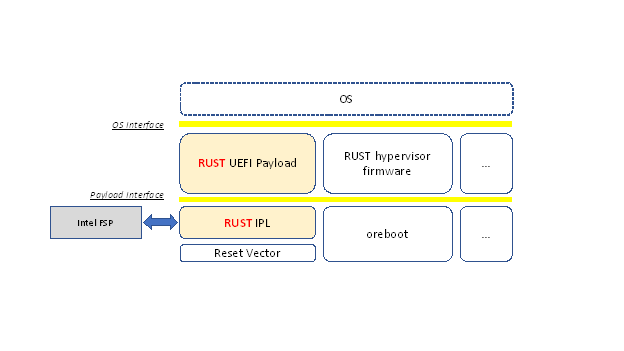
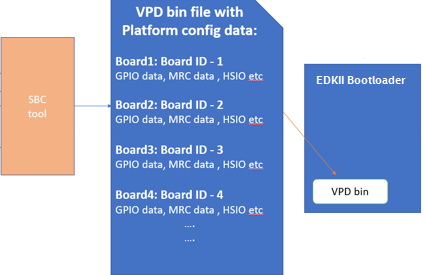

.. image:: images/media/image1.jpeg
   :width: 6.5in
   :height: 4.0625in

Universal Scalable Firmware (USF) Specification

**Version 0.7**

**October 2021**

© Copyright Content on document licensed under a Creative Commons 
Attribution 4.0 International license

Terminology
===========

   There has been a lot of confusion regarding the terminologies
   surrounding firmware and BIOS. This section describes these
   terminologies as used in this specification. Just like “Operating
   System” (OS) is a generic name for the concept of Post-Boot
   Environment, “Basic Input Output System” (BIOS) is a generic name for
   the concept of Pre-Boot Environment. Just like there are multiple
   implementations of the concept of OS, such as Linux, there are
   various implementations of the concept of BIOS, such as UEFI FW,
   u-boot, coreboot, Slim bootloader etc.

   Tiano, EDKII and Min Platform are all implementations based on the
   “Universal Extensible Firmware Interface” (UEFI) and “Platform
   Initialization” (PI) interface specifications (uefi.org).

   This Specification uses the terminology Firmware/System Firmware/BIOS
   interchangeably to indicate the Pre-Boot environment

Motivation for Universal Scalable Firmware
==========================================

   UEFI and PI Spec based BIOS implementations such as Tiano and EDKII
   has served the industry well for the past couple of decades. The goal
   is to evolve the goodness of modularity to scale for IP FW
   development model, with emphasis on simplicity, scalability,
   debuggability, readability and determinism.

Simplicity, Determinisim and Debuggability
==========================================

   All the three attributes – Simplicity, Determinism and Debuggability
   go together. BIOS plays a major role in debugging hardware, silicon
   features and various technologies (Security, Power Management, IO,
   Virtualization, RAS etc.) and should lend itself to readability and
   determining the sequence of operations by reading the source code.
   BIOS is the abstraction layer and it often times have to deal with
   unstable hardware and Silicon workarounds. A simple, debug (hardware
   debug, not just software) friendly infrastructure is called for.

   Today’s platform and SoC complexity calls for a model of replaceable
   IP Modules, with the associated FW components traveling with that IP.

   The layers of the Universal Scalable Firmware are described in the
   following diagram.

.. image:: images/media/image2.jpg
   :alt: A picture containing graphical user interface
   :width: 6.5in
   :height: 6.85208in

Figure 1 USF stack

   From the top of the stack we have the following.

OS interface
============

   These are well-known interfaces, such as ACPI, UEFI, Kexec, or
   Multiboot, that provide a means to interact with pre-OS and runtimes.

Universal Payload
=================

Universal Payload API for different OS payloads (i.e., UEFI, LinuxBoot, ACRN embedded hypervisor), and support for various bootloaders (i.e., tianocore/EDKII, coreboot, slim bootloader, u-boot
================================================================================================================================================================================================

Platform Orchestration Layer (POL)
==================================

   Simplified ACPI support, common libraries for various bootloaders &
   Rust language, standard binary configuration through YAML, support
   for FW attestation, authentication, measurement, and modern update.

Scalable Firmware Support Package (sFSP)
========================================

   Scalable Firmware Support Package (sFSP) support for 64-bit reset
   vector, SMM encapsulation, various domain modules, authentication,
   unified configuration, and SOC level validation.

.. _universal-payload-1:

Universal Payload
=================

[Guidance to editor – please integrate content from
https://github.com/UniversalScalableFirmware/documentation for
‘universal payload’ chapter]

.. _platform-orchestration-layer-pol-1:

Platform Orchestration Layer (POL)
==================================

Introduction
------------

The Platform Orchestration Layer (POL) is aimed to provide guidelines on
writing platform code that leverage a Scalable Intel Firmware Support
Package (sFSP) interface and payload to coordinate the overall platform
initialization flow.

Motivation for POL
~~~~~~~~~~~~~~~~~~

Following the Next Generation Firmware initiative, the Intel system
firmware (BIOS) is evolving to be a multilayer, modular, scalable FW
solution which fulfills all the modern FW requirements in a super
complex HW IP centric world. The layers are shown in Figure 1.

The Platform Orchestration Layer sits between the SOC Abstraction Layer
(SAL), as abstracted by the Scalable FSP interface, and the Payload
Layer. The Platform Orchestration Layer coordinates the board-specific
boot sequence, invoking the sFSP interfaces for any silicon specific
work, and produces the interface to launch the payload environment along
with industry standard tables that are an amalgam of silicon and
platform, such as SMBIOS and ACPI.

.. image:: images/media/image3.WMF
   :width: 6.5in
   :height: 3.65625in

Figure 2 Layers of Universal Scalable Firmware

Therefore, the missions of POL layer are:

-  Initialize the board by programming board specific resources and
   invoking the sFSP for SOC and/or XPU specific resources

-  Invoke payloads for OS boot environment and possible XPU and runtime.

POL Design Principles
~~~~~~~~~~~~~~~~~~~~~

POL is considered as the layer for platform code. It plays a major role
in providing vendor specific features and mainboard-specific
initialization, as distinct from the sFSP that is scoped to be
SOC-specific. The POL will be the vehicle to convey policy into the
sFSP, interact with the sFSP for initialization, and retrieve state
information from the sFSP. The architectural design of a POL shall
follow the below principles:

-  Compatibility - POL shall be compliant with FSP Specification and
   provide the configuration information into the sFSP and retrieve
   resultant output information from the sFSP.

-  Portability – POL will attempt to be as SOC independent as possible
   and allow for source level compatibility between different open
   source platform code frameworks such as EDKII, coreboot, oreboot, and
   U-Boot. The OS boot specific code is abstracted via payloads.

-  Determinism/Simplicity – POL should abstract SOC initialization
   through sFSP interfaces and have a simple boot flow.

Audience / Document scope
~~~~~~~~~~~~~~~~~~~~~~~~~

The audience for this document is BIOS/system firmware architects and
developers that design or implement or consume Intel silicon
initialization code. The document is intended to describe the
architecture directions and requirements.

.. _terminology-1:

Terminology
~~~~~~~~~~~

======= ====================================
Term    Definition
======= ====================================
Config  Abstracted configuration information
Payload OS boot container
sFSP    SOC initialization
======= ====================================

Table 1 Terminology

Reference documents
~~~~~~~~~~~~~~~~~~~

The following documents are referenced in this specification.

+-----------------+------------------------------------+-------------+
| Abbreviation    | Document                           | Version     |
+=================+====================================+=============+
| FSP_EAS         | Intel® FSP External Architecture   | Version 2.2 |
|                 | Specification v2.2:                |             |
|                 | https://cdrdv2.intel.com/          | May 2020    |
|                 | v1/dl/getContent/627153            |             |
+-----------------+------------------------------------+-------------+
| PI_SPECS        | Platform Initialization            | Version 1.4 |
|                 | Specification:                     |             |
|                 | http://www.uefi.org/sites/default/ | April 2015  |
|                 | files/resources/PI_1_4.zip         |             |
|                 |                                    |             |
|                 | -  Volume I: PEI                   |             |
|                 |                                    |             |
|                 | -  Volume II: DXE CIS              |             |
|                 |                                    |             |
|                 | -  Volume III: Shared Architecture |             |
|                 |    Elements                        |             |
|                 |                                    |             |
|                 | -  Volume IV: SMM                  |             |
|                 |                                    |             |
|                 | -  Volume V: Standards             |             |
+-----------------+------------------------------------+-------------+
| UEFI_SPEC       | Unified Extensible Firmware        | Version 2.0 |
|                 | Interface Specification:           | April 2015  |
|                 | http://www.uefi.org/sites/default/ |             |
|                 | files/resources/UEFI%202_5.pdf     |             |
+-----------------+------------------------------------+-------------+
| FSP 2.3         | https://cdrdv2.intel.com/          |             |
|                 | v1/dl/getContent/644852            |             |
+-----------------+------------------------------------+-------------+
| FSP Measurement | https://cdrdv2.intel.com/          |             |
|                 | v1/dl/getContent/644001            |             |
+-----------------+------------------------------------+-------------+
|                 |                                    |             |
+-----------------+------------------------------------+-------------+
| YAML config     | https://github.com/joshloo/        |             |
|                 | fsp_yaml_cfg/tree/master/Tools/    |             |
|                 | UserManuals                        |             |
+-----------------+------------------------------------+-------------+
| coreboot        | https://github.com/coreboot/       |             |
|                 | coreboot                           |             |
+-----------------+------------------------------------+-------------+
| Oreboot         | https://github.com/oreboot/oreboot |             |
+-----------------+------------------------------------+-------------+
| Min platform    | https://www.tianocore.org          |             |
+-----------------+------------------------------------+-------------+
| u-boot          | https://github.com/u-boot/u-boot   |             |
+-----------------+------------------------------------+-------------+
| Slim bootloader | https://slimbootloader.github.io/  |             |
+-----------------+------------------------------------+-------------+
| Payload         | https://github.com                 |             |
|                 | universalpayload/documentation     |             |
+-----------------+------------------------------------+-------------+
| openspdm        | Temp:                              |             |
|                 | https://github.com/jyao1/openspdm  |             |
|                 |                                    |             |
|                 | Official: https://github.com/DMTF  |             |
|                 | - TBD                              |             |
+-----------------+------------------------------------+-------------+

Table 2 Reference Documents

Architecture
------------

The following section describes the architecture of the POL.

POL Overview
~~~~~~~~~~~~

Following the guiding principles in chapter 1.2, the high-level
architecture of POL is shown in Figure 2. POL interfaces with the sFSP
API specification, e.g. the 6 APIs and HOB/UPD defined in FSP 2.2 spec.
On the other end, POL interfaces with the universal payload. It should
invoke the payload API after providing board initialization.

Within the POL, it has several stages:

-  POL early initialization

   -  Maps to

      -  coreboot romstage

      -  EDKII SEC/PEI

      -  Slim bootloader stage 1

-  POL late initialization

   -  Maps to

      -  Coreboot ramstage

      -  Slim bootloader stage 2

      -  EDKII DXE

-  POL runtime

   -  OEM SMM

.. image:: images/media/image4.PNG
   :alt: Diagram Description automatically generated
   :width: 4.16992in
   :height: 3.125in

Figure 3 POL High Level Architecture

Another aspect of the POL is to allow for maximum platform code re-use
across different SOC generations.

.. image:: images/media/image5.PNG
   :alt: Timeline Description automatically generated
   :width: 6.36547in
   :height: 1.21892in

Figure 4 POL re-use

Beyond re-use of platform code with different SOC’s, the POL should be
re-useable across the most used or popular boot paradigms such as a full
UEFI boot, LinuxBoot, or an embedded hypervisor.

.. image:: images/media/image6.PNG
   :alt: Diagram Description automatically generated with medium confidence
   :width: 6.5in
   :height: 2.34653in

Figure 5 Different Payloads

The Universal Payload provides the right hand side interface. There
could be additional payloads, such as an XPU initialization payload or a
validation payload, such as FSP-V. But in either case the POL
implementation should be largely independent of the SOC and the payload.

Finally, UFS allows for a world where there are various compositions of
the firmware stack. This can include RUST-based firmware as either a
payload or the platform layer implementation, as described in the figure
below:

**Figure 6 Modern language-based usage**

This architecture is based upon https://github.com/jyao1/rust-firmware

Configuration Introduction
--------------------------

| The Platform Orchestration Layer (POL) is aimed to provide guidelines
  on writing platform code that leverage a Scalable Intel Firmware
  Support Package (sFSP) interface and payload to coordinate the overall
  platform initialization flow. It needs to expose configuration, as do
  the layers below.
| To that end, YAML, which is a variant of JSON that allows for
  embedding comments, is employed in order to have a consisten

Platform configuration
~~~~~~~~~~~~~~~~~~~~~~

YAML based settings
^^^^^^^^^^^^^^^^^^^

Although the POL strives to be SOC independent, the system board’s SOC,
with its respective sFSP, and the usage of payloads, may require
different configuration. To that end, a consistent set of YAML based
configuration will be exposed to the system board builder and platform
user to configure the various elements.

YAML based configuration will be provided to abstract all of the
platform configurable elements

-  sFSP UPD

-  Platform configuration

   -  PCD/VFR for EDKII

   -  KConfig for coreboot/oreboot/u-boot

   -  DSC for slim bootloader

   -  YAML native for XPU payload

Example configuration
^^^^^^^^^^^^^^^^^^^^^

An example of an often configurable object for the platform developer is
GPIO.

An example of GPIO configuration is as follows:

- $ACTION :

page : GIO

- GPIO_CFG_DATA :

- !expand { CFGHDR_TMPL : [ GPIO_CFG_DATA, 0x400, 1, 0 ] }

- GPIO_CFG_HDR :

- GpioHeaderSize :

length : 0x01

value : \_LENGTH_GPIO_CFG_HDR\_

- GpioBaseTableId :

length : 0x01

value : 0xFF

- GpioItemSize :

length : 0x02

value : 8

- GpioItemCount :

length : 0x02

value : (_LENGTH_GPIO_CFG_DATA\_ - \_LENGTH_GPIO_CFG_HDR\_ - 8) / 8

# Bit start offset within each GPIO entry array to identify a GPIO pin
uniquely. EX: GPIO group id + pad id

# Offset is 2nd DWORD BIT16 = 1 \* 32 + 16 = 48

- GpioItemIdBitOff :

length : 0x01

value : 48

# Bit length within each GPIO entry array to identify a GPIO pin
uniquely.

# Length is 2nd DWORD BIT16 to BIT28 = 13

- GpioItemIdBitLen :

length : 0x01

value : 13

# Bit offset within each GPIO entry array to indicate SKIP a GPIO
programming

# Offset is 2nd DWORD BIT31 = 63

- GpioItemValidBitOff :

length : 0x01

value : 63

- GpioItemUnused :

length : 0x01

value : 0

# Need 1 bit per GPIO. So this mask byte length needs to be at least
(GpioNumber + 7) / 8

# Padding can be added to let the whole length aligned at DWORD boundary

- GpioBaseTableBitMask :

length : 38

value : {0}

- GpioTableData :

length : 0

value : 0

1.1.1 Example implementation
~~~~~~~~~~~~~~~~~~~~~~~~~~~~

An example of implementation in EDKII is Intel Seamless Board
Configuration (SBC). This feature provides a standardized and
centralized interface for various board HW configuration, including
GPIO, PCIe Clock, USB OC, DRAM, I2C, etc. The interface currently is
leveraging Structured PCD in VPD which allows both manually and tool
assisted modification for different HW setting in EDK2 Platform Payload.

SBC also supports multiple board configuration scenario with board
identifier mapped to SkuId in EDKII PCD.

Figure 6 Board configuration

Example implementation with Structured PCD:

gBoardModuleTokenSpaceGuid.VpdPcdBoardGpioTable|*|{CODE({

| {GPIO_PIN_1, {GpioSettingA,GpioSettingB, GpioSettingC, ...}},
| {GPIO_PIN_2, {GpioSettingA,GpioSettingB, GpioSettingC, ...}},
| …

{0x0} // terminator

})}

Components in EDKII Bootloader will consume these HW configuration while
the configuration data is already selected based on SkuId during POST.
Then these setting will be applied into silicon or board HW via sFSP.
Necessary information will also be wrapped and passed to OS, such as
GPIO related setting in ACPI Table.

Shareable platform code
~~~~~~~~~~~~~~~~~~~~~~~

For the platform implementation, there are two means of code sharing.
One way to share content is via binary universal payloads, and the other
is via source code.

TBD – example source code. Cite moving of PciBus DXE driver to slim
bootloader stage 2 code

OpenSPDM example as source code for sharing across POL implementations.

Advanced features represent a set of platform technologies that are not
needed for basic boot. These features provide a way to extend the
platform firmware capabilities.

For these features to be sharable and extensible, they must adopt a
high-cohesive, low-coupling design. This means an advanced feature
should be mostly self-contained and expose a set of well defined
interfaces that can be called by components outside the feature scope.

An advanced feature should not directly depend on another advanced
feature. Such a dependency should be resolved via an integration layer
(e.g. Board layer). The following represents a high level design of
Advanced Features.

+-------------+
| AFP1        |
+=============+
| AFP2        |
+-------------+
| AFP3        |
+-------------+
| AFP4        |
+-------------+
| Board Layer |
+-------------+

Advanced feature details 
~~~~~~~~~~~~~~~~~~~~~~~~

The low-level design and implementation of Advanced feature may vary
based on boot loaders and other preferences.

The EDKII Min Platform boot loader follows a rich set of design
guidelines conforming EDKII software framework and UEFI specification.

Examples of construction of a Min Platform can be found at
https://github.com/tianocore/edk2-platforms/blob/master/Platform/Intel/MinPlatformPkg/Docs/A_Tour_Beyond_BIOS_Open_Source_IA_Firmware_Platform_Design_Guide_in_EFI_Developer_Kit_II%20-%20V2.pdf

Shareable platform code - definition
^^^^^^^^^^^^^^^^^^^^^^^^^^^^^^^^^^^^

+In this specification, the shareable platform code focuses on **source
code sharing**. Binary sharing should be considered in scalable FSP.

1. The shareable platform code SHALL be reusable by multiple
   bootloaders, including but not limited, to EDKII, slim bootloader,
   coreboot.

2. The shareable platform code SHOULD be reusable across different boot
   phase, such as EDKII PEI/DXE/SMM phase, the coreboot ROM/RAM stage.
   This highly depends upon the use case.

3. The shareable platform code MAY be used for other firmware. For
   example, the openspdm library may be used for system firmware, BMC
   firmware, or even device firmware. It also depends upon the use case
   – if there is business need for sharing.

Shareable platform code - guideline
^^^^^^^^^^^^^^^^^^^^^^^^^^^^^^^^^^^

1. Don’t consume any boot load specific API. For example, UEFI boot
   services, PCI IO Protocol.

2. Don’t consume standard C library. Not all boot load includes standard
   C library.

3. Use static link library if possible. Don’t use dynamic link library.

4. Use heap carefully. Some environment might not have heap.

5. Use global variable carefully. Some environment may only support
   read-only variable because the code runs on the flash.

6. Don’t use inline assembly. Some build environment may not support
   inline assembly.

7. Another guideline is to not expose internal function in public header
   file. The internal header file should be hidden.

8. Define the boot loader provided library dependency clearly, such as
   Hardware Abstract Layer (HAL). It can make library porting easier.

9. Define the boot loader caller provided function dependency clearly,
   such as a callback function.

Shareable platform code – RUST binding API
^^^^^^^^^^^^^^^^^^^^^^^^^^^^^^^^^^^^^^^^^^

1. Include length parameter for any buffer.

2. Have single owner for one buffer. If the caller allocates the buffer,
   the caller shall free the buffer.

3. Define the contract between the caller and callee. E.g. If the input
   buffer is trusted or untrusted?

4. Define the error behavior clearly. Return? Deadloop? Assert?

Interface definitions
~~~~~~~~~~~~~~~~~~~~~

Shareable platform code APIs 
^^^^^^^^^^^^^^^^^^^^^^^^^^^^

Min Platform Advanced Feature Packages (AFP) in EDKII, coreboot 3rd party directory code
''''''''''''''''''''''''''''''''''''''''''''''''''''''''''''''''''''''''''''''''''''''''

Provide example of the Pci enumeration code/library

Show the generic code such as sharable openspdm

Shareable board ASL
^^^^^^^^^^^^^^^^^^^

TBD
'''

Shareable platform code APIs – Rust bindings
^^^^^^^^^^^^^^^^^^^^^^^^^^^^^^^^^^^^^^^^^^^^

.. _tbd-1:

TBD
'''

XPU considerations
------------------

One of the goals of the USF effort is to help support all classes of
silicon , namely XPU’s. An XPU can be a CPU, such as the SOC based upon
Intel Core, Intel Atom, RISC-V or ARM. In addition, the XPU can include
integrated or discrete graphics (iGFX/dGFX), FPGA, AI, networking, or
acceleration.

To that end, there are various aspects of the XPU support.

These include configuration, update, monitoring, and access, both during
the pre-OS and at OS runtime. In the future the latter may move into
level 0, but for now the USF shall treat these.

Like other aspects of USF, XPU considerations are in the POL
specification since the platform is where all of the system components
come together.

Configuration
~~~~~~~~~~~~~

To configure the XPU, a canonical YAML based configuration file will be
provided.

Build time
^^^^^^^^^^

Post ship
^^^^^^^^^

Pre-OS
''''''

Runtime
'''''''

Initialization
~~~~~~~~~~~~~~

Initialization can include having the XPU as part of the sFSP, a
dedicated payload, a UEFI or legacy BIOS option ROM, or some open source
POL portable library.

Open source portable initialization code
^^^^^^^^^^^^^^^^^^^^^^^^^^^^^^^^^^^^^^^^

Dedicated payload 
^^^^^^^^^^^^^^^^^

Option ROM (e.g., dGFX or networking HBA)
^^^^^^^^^^^^^^^^^^^^^^^^^^^^^^^^^^^^^^^^^

sFSP element (e.g., iGFX in Core CPUs)
^^^^^^^^^^^^^^^^^^^^^^^^^^^^^^^^^^^^^^

Update
~~~~~~

It is critical to support both the factory time integration of the XPU
support into the IFWI and/or post ship update of XPU support code.

Slim bootloader update payload
^^^^^^^^^^^^^^^^^^^^^^^^^^^^^^

Overview
''''''''

SBL embedded a built-in Firmware Update (FWU) payload to perform a
secure and power fail-safe firmware update flow. It contains redundant
boot partitions and depends on hardware assisted boot partition switch
to support fail-safe update.

SBL provides abstracted ACPI/WMI interface to trigger FWU flow, EDK2
similar capsule update mechanism to pass the new firmware to bootloader,
and EDK2 similar way to report the FWU status back to OS through ACPI
table.

Firmware Update Flow
''''''''''''''''''''

SBL firmware update flow utilizes redundant boot partition to perform
firmware update in a reliable way. It involves the following high-level
steps:

-  Boot from Partition A

-  Update Partition B

-  Activate Partition B

-  Reboot

-  Boot from Partition B

-  Update Partition A

-  Activate Partition A

-  Reboot

-  Report Firmware Update status

-  Terminate firmware update flow.

-  Reset system to continue booting to operating system.

Below is a detailed FWU flow chart for SBL.

.. image:: images/media/image9.png
   :width: 6.14124in
   :height: 4.89583in

Figure 7

-  Firmware Update capsule is copied to designated location. This
   location is configurable through SBL configuration options.

-  Firmware update is triggered from SBL shell or from Operating system
   and followed by a system reset.

-  SBL detects firmware update signal and sets platform into firmware
   update mode.

-  SBL identifies firmware update mode and loads firmware update payload
   to start update flow.

-  Firmware Update payload gathers capsule image from selected media and
   verifies capsule data. If successful, continues with firmware update.

-  Firmware update payload initializes state machine and identifies the
   update images in the capsule.

-  FWU payload loops through and updates each firmware identified in the
   capsule image.

-  FWU records update status after each firmware update.

-  If the firmware is requesting reset after update, reset the system to
   continue updating other firmware in the capsule.

-  In case of a power failure, FWU payload will use the state machine
   stored in flash to resume from the interrupted state.

Firmware Update Triggering
''''''''''''''''''''''''''

SBL provides a platform independent abstracted way of triggering
firmware update from operating system through ACPI or WMI interfaces.

SBL provides common ACPI methods, DWMI.WQ00 for read and DWMI.WS00 for
write to a platform specific chipset register that can survive a reset
to signal firmware update. This ACPI method can be called by driver or
application to request triggering a firmware update. On the following
reboot flow, once the firmware update signal is detected, this signal
will be stored into flash so that the following firmware update flow can
resume in case of a power failure in the middle of the process.

For OS that supports WMI, such as Windows, SBL further exposes
AcpiFirmwareCommunication WMI service through ACPI table to allow
triggering firmware updates directly using WMI from applications.

Firmware Update Status
''''''''''''''''''''''

SBL reports firmware update status through custom defined Firmware
Update status (FWST) ACPI table. FWST ACPI table will be available as
part of RSDT and can be identified with a table signature “FWST”. FWST
ACPI table makes use of EFI_SYSTEM_RESOURCE_TABLE defined in UEFI
specification to report firmware update status. It adds additional ACPI
header on top of it to make it conform to ACPI speciation. OS can use
this ACPI table to retrieve the previous firmware update information.

UEFI capsule update
^^^^^^^^^^^^^^^^^^^

AB update of payload for coreboot
^^^^^^^^^^^^^^^^^^^^^^^^^^^^^^^^^

Monitoring
~~~~~~~~~~

The ability to ascertain status of the platform and XPU’s has various
modalities.

UEFI tables
^^^^^^^^^^^

ACPI
^^^^

POL examples
------------

This chapter gives a reference implementation of POL under EDKII
framework. Below shows the code layout that POL has a dedicated package
to hold all POL related code.

Slim bootloader
~~~~~~~~~~~~~~~

Slim Bootloader (SBL) is a flexible, lightweight, and open-source
reference boot loader solution designed for Intel platforms. SBL is
architected with a modular approach by providing very basic hardware
initialization in bootloader, then launching a payload to boot to final
OS or application. The payload is flexible and can be at user’s choice
to meet special needs. The SBL overall architecture is shown in the
diagram below:

.. image:: images/media/image10.png
   :width: 6.36458in
   :height: 2.10417in

Figure 8: SBL Architecture

SBL takes a linear staged boot approach to initialize the platform. As
illustrated in the diagram below, in each stage, SBL utilizes Intel® FSP
API interfaces to initialize the silicon and utilizes static library
interfaces to initialize the board. These static library interfaces are
aligned with EDK2 base library implementation to abstract board
initialization API. For examples\ |image1|, GPIO initialization, ACPI
initialization, etc.

Figure 9

The detailed SBL stages are listed in the table below:

+----------+----------------------------------------------------------+
| Stage    | Description                                              |
+==========+==========================================================+
| Stage 1A | Stage 1A contains reset vector and is first stage to     |
|          | gain control. It is responsible for very basic platform  |
|          | execution environment initialization to enable following |
|          | stage execution. It includes temporary memory, debug     |
|          | port, etc.                                               |
+----------+----------------------------------------------------------+
| Stage 1B | Stage 1B is the “pre-memory” stage and is responsible    |
|          | for loading configuration data and initialization system |
|          | main memory. After memory is available, it will load and |
|          | verify Stage2 for execution.                             |
+----------+----------------------------------------------------------+
| Stage 2  | Stage 2 is the “post-memory” stage and is responsible    |
|          | for all initialization the remaining platform, including |
|          | chipset, CPU, I/O, ACPI, PCI, etc.                       |
+----------+----------------------------------------------------------+
| Payload  | Payload is the bridge between bootloader and the OS. It  |
|          | provides standard boot device initialize to further      |
|          | load, verify and launch OS images. It also performs      |
|          | specific actions, such as firmware update.               |
+----------+----------------------------------------------------------+

As stated above, SBL utilizes static library class to abstract the API
interfaces for platform initialization. These libraries are written in
pure C language so that it can easily be shared between different boot
solutions. For example, many base library instances in EDK2 MdePkg are
directly leveraged by SBL. Many other libraries, such as SoC access
libraries, feature libraries are also ported from corresponding EDK2
libraries through removing UEFI specific dependencies. In addition, ACPI
ASL files are also borrowed from EDK2 directly. These sharable libraries
and files make it easier to quickly enable a platform using the boot
solution at user’s choice.

.. image:: images/media/image12.png
   :width: 5in
   :height: 3.03125in

u-boot
~~~~~~

U-Boot can be fabricated as a POL or a payload.

Oreboot
~~~~~~~

Oreboot is a RUST-based POL example

coreboot
~~~~~~~~

coreboot is a POL example

EDKII
~~~~~

| EDKII can be used to create an FSP, such as
  https://github.com/tianocore/edk2/tree/master/IntelFsp2Pkg described in https://www.intel.com/content/dam/develop/public/us/en/documents/a-tour-beyond-bios-creating-the-intel-firmware-support-package-with-the-efi-developer-kit-ii-fsp2-0.pdf
| EDKII can also be a POL, including the MinPlatform
  https://github.com/tianocore/edk2-platforms/blob/master/Platform/Intel/Readme.md.

EDKII can also be used to create a payload, such as
https://github.com/tianocore/edk2/tree/master/UefiPayloadPkg.

Components
^^^^^^^^^^

Components in EDKII based firmware can be separated into three
categories:

-  EDKII Bootloader

-  UEFI Universal Payload

-  EDKII UEFI Platform Payload (Optional)

.. image:: images/media/image13.png
   :width: 6.5in
   :height: 0.79583in

Figure 10

The system boot starts from EDKII Bootloader where the FSP is invoked to
initialize the silicon. Then the Bootloader follows the Payload
specification to load and start UEFI Universal Payload. It may pass
additional FV location information to UEFI Universal Payload which tells
the optional EDKII UEFI Platform Payload.

EDKII Bootloader consists of reset vector code, necessary platform
specific code and EDKII generic code that launches FSP. In the end of
EDKII Bootloader, it transfers the control from EDKII Bootloader to UEFI
Universal Payload through DxeIpl PEIM. Each platform vendor develops its
EDKII Bootloader and the implementations for different platforms are
different.

UEFI Universal Payload consists of all the platform agnostic drivers
that prepare the UEFI OS booting environment. For example, the RTC
driver to support UEFI time services, the MTC driver to support the UEFI
Monotonic Counter services. The “Universal” in the name stands for the
goal that the same payload binary can be used by different bootloaders
and different platforms. There is only one implementation instance of
the UEFI Universal Payload. For example, Slim bootloader and EDKII
Bootloader can boot to UEFI OS by using the same UEFI Universal Payload.
All the SOC and platform specific information is abstracted in EDKII
Bootloader and passed to UEFI Universal Payload. The abstraction format
is defined by Payload specification.

EDKII UEFI Platform Payload is an optional component. It consists of
platform specific |Diagram Description automatically
generated|\ implementations that must be done in payload phase.
Theoretically this component can be eliminated by moving all
implementations to EDKII Bootloader.

Figure 11

Data Flow
^^^^^^^^^

EDKII Bootloader passes SOC and platform information through HOBs to
UEFI Universal Payload. UEFI Universal Payload interacts with EDKII UEFI
Platform Payload through Protocols. EDKII Bootloader can use any
mechanism to pass information to EDKII UEFI Platform Payload since both
are owned by the platform vendor.

.. image:: images/media/image15.png
   :alt: Diagram Description automatically generated
   :width: 6.5in
   :height: 2.86319in

Figure 12

.. _runtime-1:

Runtime
=======

.. _introduction-1:

Introduction
------------

In addition to the boot-time POL, there are runtime variants.

.. image:: images/media/image16.jpg
   :alt: Timeline Description automatically generated
   :width: 6.5in
   :height: 3.65625in

Figure 13: POL and runtime

.. _acpi-1:

ACPI
~~~~

PRM
^^^

UEFI Runtime
~~~~~~~~~~~~

SMM
~~~

Security 
========

Security Overview
-----------------

There are various security considerations for the POL, sFSP, and the
payloads. This section will describe the various overall concerns and
technology specific aspects.

Protection
~~~~~~~~~~

Critical Resource Lock (hardware)
^^^^^^^^^^^^^^^^^^^^^^^^^^^^^^^^^

The platform shall always lock the important resource before it exits
the platform manufacture phase.

The important resource includes but is not limited to flash part, SMRAM,
SMRR, silicon register such as lockable BAR register,

Critical Service Close (software)
^^^^^^^^^^^^^^^^^^^^^^^^^^^^^^^^^

The platform shall always close the service that may impact the system
resource.

The service includes but is not limited to SMM registration service,
flash update service.

Critical Resource Access
^^^^^^^^^^^^^^^^^^^^^^^^

The platform shall only allow the critical resource access in the
trusted execution environment such as SMM.

.. _update-1:

Update
^^^^^^

The platform shall only allow firmware update only in the trusted
execution environment such as SMM, or before existing the platform
manufacture phase.

The update must check the secure version number to prevent rollback.

Detection
~~~~~~~~~

Secure Boot (verified boot)
^^^^^^^^^^^^^^^^^^^^^^^^^^^

The platform shall enable secure boot. The early boot component shall
verify the next component.

Care must be taken for Time-of-check/Time-of-use (TOC/TOU) attack.

The early component shall copy the next component to a trusted execution
environment, verify and use.

Secure Configuration (data verification)
^^^^^^^^^^^^^^^^^^^^^^^^^^^^^^^^^^^^^^^^

If the configuration has security property, such as lock/unlock policy.
It shall be protected and verified.

The secure configuration may be treated as code and verified together
with secure boot.

Or the secure configuration may be protected by the variable
enhancement, such as RPMB or RPMC.

Recovery
~~~~~~~~

Recovery trigger
^^^^^^^^^^^^^^^^

A platform should have a watchdog to auto trigger recovery process
automatically. Otherwise, it should notify the end user that a manual
recovery is required.

Known good image
^^^^^^^^^^^^^^^^

The recovery process may load a known good image. The known good image
itself shall be protected and follow the detection flow.

The known good image shall be up to date as well, to resist rollback
attack – recovery to an old known bad image.

Attestation
~~~~~~~~~~~

Trusted Boot (measured boot)
^^^^^^^^^^^^^^^^^^^^^^^^^^^^

The platform shall enable trusted boot. The early boot component shall
measure the next component before transfer control to it, to create a
trust chain.

Completeness
^^^^^^^^^^^^

The platform shall follow TCG specification to measure all required
component. For example, the platform shall measure every boot component.
The platform shall measure any security-related boot configuration.

Debug 
=====

Debug Overview
--------------

In this specification, the word ‘trace’ is used for any message that is
generated by BIOS components for debug purposes. These typically include
postcodes, status codes and string messages.

The general philosophy is to provide a simple and ubiquitous solution
that supports a range of debug solutions to help with BIOS debug and
tracing needs.

Requirements
~~~~~~~~~~~~

This section summarizes a set of requirements to ensure common debug and
trace features are supported by all modules.

Trace interfaces
^^^^^^^^^^^^^^^^

-  BIOS shall support sending trace messages to all BIOS accessible HW
   interfaces on the platform.

-  BIOS shall support enabling and disabling the trace interfaces
   individually.

-  BIOS modules don’t control which trace output is used.

   -  SAL layer shall implement a middleware trace class which routes
      the messages to enabled interfaces such as NPK or UART. Enabled
      trace interfaces may be selected at build time but run time
      selection is preferred.

-  Enabled trace interfaces shall be initialized once before the first
   trace message is sent.

Trace data
^^^^^^^^^^

-  BIOS trace to NPK shall follow MIPI Sys-T specification catalog
   format and BIOS error levels shall comply to Sys-T definition
   matching verbosity level definition at bit level.

-  BIOS build shall output a catalog dictionary file for decoding the
   trace.

   -  Generating the dictionary file shall not exceed BIOS build time
      requirements.

-  BIOS module trace shall comply to Intel Trace Specification.
   <*provide link if available>*

-  BIOS shall support both build time and boot time trace verbosity
   filtering.

-  Enabling BIOS trace feature shall meet release build binary size and
   performance requirements.

Design
~~~~~~

Source level debugging
~~~~~~~~~~~~~~~~~~~~~~

**YAML Format Boot Configuration**
==================================

.. _introduction-2:

Introduction
------------

This document describes the format of the YAML based boot setting file
used to specify features, settings, and tool display information to the
Intel Firmware Support Package (FSP) and tools like Config Editor. It
further describes the structure and content of YAML format files, which
can simplify the configuration of a static binary and during dynamic
boot process.

Target Audience
---------------

This document is intended for person creating and using firmware images.
It is most likely of interest if a developer needs to create customized
feature and expose binary settings for delivery to customers, or that a
new SOC device is being enabled.

Configuration Description (YAML) Explained
------------------------------------------

The declarations required to build the configuration data blobs and the
header files are provided in a configuration description file. This file
uses the **YAML** syntax.

**YAML** (`https://yaml.org/ <https://yaml.org/>`__) is a data
serialization language designed to be human-friendly and work well with
modern programming languages. A quick syntax reference can be found here
- https://yaml.org/refcard.html

Configuration **YAML** files will be processed by configuration tools
like GenCfgData, CfgDataTool, CfgDataStitch in order to generate the
configuration header files and binary blobs.

The main platform configuration file is specified in CfgDataDef.yaml.
Please note that you may find many YAML files. However, only
CfgDataDef.yaml is the primary file used for the platform configuration,
and other sub YAML files will be included by the primary YAML file to
provide component specific configuration.

An example configuration file in YAML syntax is provided in Figure 15
below.

.. image:: images/media/image17.png
   :width: 6.26042in
   :height: 4.6291in

Figure 14

File Layout
-----------

The configuration YAML file has a basic organization as below

-  **Variable** declarations

-  **Template** declarations

-  **Configuration** declarations

Meta-Data Markers
~~~~~~~~~~~~~~~~~

The configuration YAML files uses the $ sign as meta-data indicator.
This is used by the SBL configuration parsing tools.

The current specification version supports the following meta-data
markers.

$ACTION
^^^^^^^

**$ACTION** is a meta-data marker and is followed by a YAML mapping node
that contains some meta-data. The following attributes are supported
currently.

PAGE
^^^^

PAGE is used to declare a list of pages used in the GUI.

PAGE is also used to define the display scope for a configuration
parameter and can be applied for individual configuration parameters.

In this way multiple configuration parameters can be grouped to be
visually displayed together in the same page in GUI.

Since the page: value(s) is a meta-data used by the tool (not a
configuration option itself), it has be preceded by the **$ACTION**
node.

**Format:**

   page: PageId1:ParentPageId1:PageTxetDescription1, PageId2:
   ParentPageId2:PageTxetDescription2

If a root page needs to be defined, the ParentPageId could be empty as
below:

   page: RootPageId::RootPageTxetDescription

.. image:: images/media/image18.png
   :width: 6.6928in
   :height: 3.375in

Figure 15

$STRUCT
^^^^^^^

The STRUCT directive is used to indicate a nested structure within a
configuration structure.

For example, consider the nested structure below:

   typedef struct {

   UINT32 Acpi : 1;

   UINT32 MeasuredBoot : 1;

   UINT32 Vt : 1;

   UINT32 eMMCTuning : 1;

   UINT32 DciDebug : 1;

   UINT32 Rsvd1 : 27;

   } FEATURES_DATA;

   typedef struct {

   FEATURES_DATA Features;

   } FEATURES_CFG_DATA;

The following example shows this declaration using a $STRUCT as shown
below

.. image:: images/media/image19.png
   :width: 6.21875in
   :height: 6.18154in

Figure 16

- $ACTION :

page : FEATURES:PLT:"Features"

- FEATURES_CFG_DATA :

- !expand { CFGHDR_TMPL : [ FEATURES_CFG_DATA, 0x310, 0, 0 ] }

- !expand { FEATURES_TMPL : [ 0x0000001F ] }

YAML Tags
~~~~~~~~~

YAML represents type information of native data structures with a simple
identifier, called a tag. Explicit typing is denoted with a tag using
the exclamation point (“!”) symbol. The following application-specific
local tags are used.

!INCLUDE
^^^^^^^^

Configuration declarations may be logically organized in multiple files.
Additional YAML files are included in the CfgDataDef.yaml using
“!include” tag.

*!include* statement may appear within any section. A relative file path
is required to specific the file path to be included. This path should
be relative to the current YAML file containing the *!include*
statement. The file content to be included must match the content type
of the current section definition, contain complete sections, or
combination of both.

Statements in *!include* files must not break the integrity of the Yaml
file, the included file is read by parsing tools in the exact position
of the file, and is functionally equivalent to copying contents of the
included file and pasting them into Yaml. The indentation of the
included file will be adjusted automatically so that the top-level
indentation in the included file has the same level as the *!include*
statement line. line.

**Format:**

- !include RelativeFilePath

**Example:**

- !include Platform/CommonBrdPkg/CfgData/CfgData.yaml

- !include Platform/Rvp7Pkg/CfgData/CfgData_GPIO.yaml

!EXPAND
^^^^^^^

“!expand” tag is used for declaring a configuration option defined by a
template
(`Template <https://slimbootloader.github.io/specs/config.html?highlight=yaml#sbl-template>`__).
*!expand* tag can only appear in *template* or *configs* section.

**Format:**

   - !expand { CfgTmplName: [Param1, Param2, ….] }

Using the CFGHDR_TMPL template example:

CFGHDR_TMPL: >

- CfgHeader :

length : 0x04

value : {0x01:2b, ((_LENGTH_$(1)_)/4):10b, $(3):4b, $(4):4b, $(2):12b}

- CondValue :

length : 0x04

value : 0x00000000

- !expand { CFGHDR_TMPL : [ PLATFORMID_CFG_DATA, 0x0F0, 0, 0 ] }

Here, the template CFGHDR_TMPL will be expanded with its full template
body. $(1), $(2), $(3) in template body will be replaced with the
appropriate parameters where:

-  $(1) is replaced with PLATFORMID_CFG_DATA,

-  $(2) is replaced with 0x0F0,

-  $(3) is replaced with 0,

-  and $(4) is replaced with 0.

Variable
--------

Variables may be considered as something equivalent to a C language
macro. Variables are primarily used as symbolic names given to Python
expressions. Whenever the variable name is used, it is replaced by the
contents of the macro. Variables should only be defined in *variable*
section.

Example:

   variable:

   COND_GPIO_SKIP : ($GPIO_CFG_DATA.$(1)_Half0.GpioSkip == 0)

Template
--------

Templates are used to declare the format of configuration options and
are useful when many configuration options of the similar type are
needed. GPIO configuration option is a good example where templates are
useful. A platform may have a lot of GPIO pins and instead of declaring
configuration options for GPIO_1, GPIO_2, GPIO_3, etc., a template for
GPIO can be declared and each GPIO can reuse the same configuration
template with different values as needed.

Templates should be declared in *template* section only, and should
always be represented as a mapping node using folded block style
indicated by a right angle bracket (>).

Templates support reference to parameters to customize the expansion.
$(n) can be used to refer to the Nth parameter passed into this template
macro by *!expland* tag. During expansion, $(n) will be substituted with
the actual Nth parameter.

For example, a template for PCIe root port configuration is shown below:

   PCIERP_TMPL: >

   - PcieRpFeatures$(1) :

   - $STRUCT :

   name : PCIE RP $(1) Config Data

   struct : PCIE_RP_FEAT[]

   length : 0x01

   value : $(2)

   - En :

   name : PCIE RP Enable

   type : Combo

   option : $EN_DIS

   help : >

   ENABLE- Enable this PCIE RP. DISABLE- Disable this PCIE RP

   order : 0000.0000

   length : 1bB

   - ClkReqSup :

   name : PCIE RP Clk Req Support

   type : Combo

   option : $EN_DIS

   help : >

   Enable/Disable CLKREQ# Support

   condition : $(COND_PCIE_RP_EN)

   length : 1bB

   - ClkReqNum :

   name : PCIE RP Clk Req Number

   type : EditNum, HEX, (0x00, 0xFF)

   help : >

   Configure Root Port CLKREQ Number if CLKREQ is supported

   condition : $(COND_PCIE_RP_CLK_REQ_SUP)

   length : 3bB

   - Aspm :

   name : PCIE RP Aspm

   type : EditNum, HEX, (0x00, 0xFF)

   help : >

   PCI Express Active State Power Management settings

   condition : $(COND_PCIE_RP_EN)

   length : 3bB

   Now, multiple PCIe root part configurations are declared using
   !expand
   (`!EXPAND <https://slimbootloader.github.io/specs/config.html?highlight=yaml#sbl-expand>`__)
   as below:

   - PCIE_RP_CFG_DATA :

   - !expand { CFGHDR_TMPL : [ PCIE_RP_CFG_DATA, 0x302, 0, 0 ] }

   - !expand { PCIERP_TMPL : [ 0 , 0x8B ] }

   - !expand { PCIERP_TMPL : [ 1 , 0x8F ] }

   - !expand { PCIERP_TMPL : [ 2 , 0x87 ] }

   - !expand { PCIERP_TMPL : [ 3 , 0x86 ] }

   - !expand { PCIERP_TMPL : [ 4 , 0x83 ] }

   - !expand { PCIERP_TMPL : [ 5 , 0x8E ] }

Configs
-------

This section contains the configuration option declarations.

A YAML **node** represents a single native data structure. A **mapping
node** is an unordered set of *key: value* node pairs. Mappings use a
colon and space (“: “) to mark each key: value pair.

A **block sequence** is simply a series of nodes, each denoted by a
leading “-” indicator. The “-” indicator must be separated from the node
by white space. YAML’s **block collections** use indentation for scope
and begin each entry on its own line.

SBL configuration options are a series of YAML block sequence and form a
YAML block collection.

Every ConfigDataDef.yaml configs section starts with the declaration for
the **CDATA_BLOB_HEADER** as shown in `Config BLOB
Header <https://slimbootloader.github.io/specs/config.html?highlight=yaml#sbl-config-blob-header>`__
followed by a series of configuration data identied by unique tags:

   configs:

   - $ACTION :

   page : PageId1::"Page Display Text", PageId2::"Page Display Text",
   PageId3::"Page Display Text", ...

   - Signature :

   length : 0x04

   value : {'CFGD'}

   - HeaderLength :

   length : 0x01

   value : 0x10

   - Reserved :

   length : 0x03

   value : {0,0,0}

   - UsedLength :

   length : 0x04

   value : \_LENGTH\_

   - TotalLength :

   length : 0x04

   value : 0x2000

As discussed in `SBL Configuration
Tags <https://slimbootloader.github.io/specs/config.html?highlight=yaml#sbl-config-tags>`__,
SBL configuration options are organized as groups.

-  Each group **is** represented **as** a **YAML** block sequence
   **and** starts **with** a leading "-" indicator followed by a white
   space.

-  Each group has a configuration header. The Configuration header
   **is** declared using "!expand" tag to expand a template declaration.
   The configuration header itself **is** a **YAML** block sequence

-  Each configuration option within the group **is** also a block
   sequence made of mapping nodes, each **with** key:value pair.

The following example will illustrate how a MrcFastBoot config option is
declared

   - MrcFastBoot :

   name : MrcFastBoot

   type : Combo

   option : $EN_DIS

   help : >

   Enable/Disable MRC fast boot support

   length : 0x01

   value : 0x1

The below shows the MrcFastBoot config option being under
MEMORY_CFG_DATA.

   - MEMORY_CFG_DATA :

   - !expand { CFGHDR_TMPL : [ MEMORY_CFG_DATA, 0x200, 0, 0 ] }

   - MrcFastBoot :

   name : MrcFastBoot

   type : Combo

   option : $EN_DIS

   help : >

   Enable/Disable MRC fast boot support

   length : 0x01

   value : 0x1

Example showing the MrcFastBoot config option being under
MEMORY_CFG_DATA which is displayed in a “MEM” page.

   - $ACTION :

   page : MEM

   - MEMORY_CFG_DATA :

   - !expand { CFGHDR_TMPL : [ MEMORY_CFG_DATA, 0x200, 0, 0 ] }

   - MrcFastBoot :

   name : MrcFastBoot

   type : Combo

   option : $EN_DIS

   help : >

   Enable/Disable MRC fast boot support

   length : 0x01

   value : 0x1

Configuration Option Nodes
~~~~~~~~~~~~~~~~~~~~~~~~~~

The below sections explain each of the “keys” used in a configuration
option.

NAME
^^^^

NAME gives a plain-text label for a configuration parameter. This is the
text label that is displayed in the Config Editor tool.

Format:

   name: CfgItemName

Example:

   name : MrcFastBoot

TYPE
^^^^

TYPE defines the format of a configuration parameter that will be
represented in the Config Editor tool. There are 5 different types
available for configuration parameters: **EditNum**, **EditText**,
**Combo**, **Table**, **Reserved**

EditNum
'''''''

EditNum is used when user needs to input any value within the range
defined. If the configuration option is an array, the VALUE field is
used to specify the number of elements in the array.

Format:

   type : EditNum, NumType, (MinValue, MaxValue)

   NumType could be \**HEX*\* (Hexa-Decimal format) **or** \**DEC*\*
   (Decimal format)

   The MinValue **and** MaxValue **is** the minimum **and** maximum
   value allowed.

EditText
''''''''

EditText is used when user needs to input any text string.

   Format:

   type : EditText

Combo
'''''

Combo is used to select from a drop-down list along. This list will be
provided by OPTION field.

Format:

   type : Combo

   option : val1:text1, val2:text2, val3:text3, ...

Example:

   type : Combo

   option : 0:9600, 1:19200, 2:38400, 3:57600, 4:115200

Table
'''''

Table is used to define a tabular format. It needs to be used along with
OPTION field to provide additional information for the table including
column header string, cell width and cell format. Further, the VALUE
field specifies the total number of elements in the table.

Format:

   type : Table

   option : ColumnHdr1:width:format, ColumnHdr2:width:format,
   ColumnHdr3:width:format, ...

ColumnHdr’n’ sepcifier indicates the string to be displayed as the
column header. width indicates the cell width in number of bytes format
is the number format and should be HEX

Example:

   type : Table

   option : >

   0:1:HEX, 1:1:HEX, 2:1:HEX, 3:1:HEX, 4:1:HEX, 5:1:HEX, 6:1:HEX,
   7:1:HEX, 8:1:HEX, 9:1:HEX, A:1:HEX, B:1:HEX, C:1:HEX, D:1:HEX,
   E:1:HEX, F:1:HEX

Byte width in each cell of the table can be displayed as 1 byte, 2 bytes
or 4 bytes.

Reserved
''''''''

Reserved type can be used to prevent configuration parameters from being
displayed in the Config Editor. But the configuration parameters will
still be generated in the auto-generated C header structure.

Format:

   type : Reserved

OPTION
^^^^^^

This allows to provide type-specific additional information. For type
Combo, it defines the drop-down list. For type Table, it defines the
column display information.

Format:

   OPTION: > Value1:TextStr1, Value2:TextStr2, ….

Note: Config tools allow the value/contents for OPTION to be split into
multiple lines. The lines except for the very first line need to start
with ‘\ **+’ (plus sign)** to tell the parsing tool to append this
string to previous one.

HELP
^^^^

This defines what will appear in the ‘help’ text when hovering over the
field in the UI tool.

Format:

   help: > Any detail about particular CfgItem

Example:

   help: > Enable/disable LAN controller

Note: Config tools allow the value/contents for HELP to be split into
multiple lines. The lines except for the very first line need to start
with ‘\ **+’ (plus sign)** to tell the parsing tool to append this
string to previous one.

CONDITION
^^^^^^^^^

CONDITION is used to associate conditional statement for a configuration
parameter when required. It is useful to dynamically hide/display a
configuration parameter that has a dependency on another configuration
parameter value. When the condition is TRUE, the configuration parameter
is visible. Otherwise, it is hidden.

Format:

   condition: Expression

Expression is an expression following Python\* syntax. It can have
reference to another configuration parameter using $\ *CfgItemName* or
*$CfgItemName.BitField* format. It can use variables as described in 3.3

Example:

   condition : $GPIO_CFG_DATA.GpioPinConfig1_$(1).GPIOSkip_$(1) == 0

   condition : $SECURITY_CFG_DATA.EnableSgx != 0 and
   $SECURITY_CFG_DATA.EpochUpdate == 2

ORDER
^^^^^

ORDER can be used to adjust the display order for the configuration
parameters in a page. By default, if this command is not specified, the
order value is assigned to be the CfgitemOffset as the logic described
below. But if a different order is required, it can be overridden by
declaring **ORDER** command explicitly using format:

   order : {HexMajor.HexMinor}

The final order key is calculated as:

   Order = (HexMajor << 16) + (((HexMajor & 0xFF) << 8) + BitFieldOffset

If ORDER {HexMajor.HexMinor} is not specified for an item, it is
calculated as: Order = (CfgItemOffset << 16)

The item order value is used as the *sort key* during YAML items
display.

Example:

   order :{0000.0000}

   order :{0x0040.01}

LENGTH
^^^^^^

Length is used to specify the size of the configuration option in bytes.
Length can also be specified in bits by appending ‘b’ at the end.

Example:

   length : 1b

   length : 0x04

VALUE
^^^^^

Value is used to specify the default value of the configuration option.
It could be a number, string, or data array.

-  For number, it can be DEC or HEX. HEX needs to have prefix ‘0x’.

-  For array, **{** **}** braces are required around the element list.
   List elements should be numbers and are separated by comma. Each
   element should have the same unit size (1, 2, 4, 8 bytes). By
   default, it is BYTE for each element. The unit size can be changed
   through an extended dummy element at the beginning of the array,
   noted as “0:0[B|W|D|Q]”.

-  For string, single or double quotes are required.

Example:

   value : 0xFF

   value : {0, 1, 3, 2, 4, 5, 6, 7}

   {0:0B, 0x01, 0x02, 0x03, 0x04, 0x05, 0x06, 0x07, 0x08}

   {0:0W, 0x0201, 0x0403, 0x0605, 0x0807}

   {0:0D, 0x04030201, 0x08070605}

   {0:0Q, 0x0807060504030201}

   value : 'FwuImage.bin'

Delta (DLT) File Explained
--------------------------

Configuration Delta (DLT) file is an extension of the base configuration
YAML file that contains configuration parameters that need to be
overridden from base configuration.

Each board flavor can have one DLT file specified. YAML and DLT files
reside at the Platform folder in source. Delta files are **NOT**
auto-generated files.

In addition to board-specific delta files, a delta file that overrides
configuration parameters for all boards (board ID 0) is also supported.
Users can add/create new DLT file for each board flavor of the same SOC
with the help of board-specific PlatformId (1 – 31) that should be
specified in each file. Parsing tool will then calculate bit mask/value
for each tag that is included in base configuration YAML against each
board’s PlatformID specified in .DLT and populates relevant data based
on PlatformID in the form of binaries (.bin) for each of the boards.

If config parameters did not change for a tag, data is taken from base
configuration itself. If it has changed for a particular tag mentioned
in .DLT, new data from DLT will be overwritten and gets generated in the
configuration binary for that specific board.

DLT file rules
--------------

-  Users cannot add/create a new configuration parameter in DLT file,
   nor can they create a new tag. Users can only modify/overwrite the
   values for configuration parameters that are already existing in the
   base configuration YAML file.

-  Delta file can be used to generate both default and custom/standalone
   config data. Delta file is like changing configuration items using
   *ConfigEditor* (explained later).

-  Delta file cannot be opened in UI interface all by itself. But it’s
   possible to open in *ConfigEditor* by first loading the base
   configuration YAML, and then load DLT file on top of it. We can then
   see overrides in *ConfigEditor* that is mentioned in DLT.

-  Delta files should be included as part of the Board Configuration
   script, BoardConfig.py in order to take effect.

Example:

   self._CFGDATA_INT_FILE = ['CfgData_Int_Brd0_Def.dlt']

   self._CFGDATA_EXT_FILE =
   ['CfgData_Ext_Brd1_Rvp.dlt','CfgData_Ext_Brd2_Crb.dlt','CfgData_Ext_Brd3_Bmp.dlt']

-  ‘_CFGDATA_INT_FILE’ is used for all the default board flavors. Delta
   files included here is generated as part of the default configuration
   data consumed within the source.

-  ‘_CFGDATA_EXT_FILE’ is used for external/customer boards. Delta files
   included here is generated as a standalone binary and stitched into
   the BIOS region of the SPI Flash.

-  Below are the current formats that can be used in DLT:

   -  Hash “#” symbol indicates comments in the DLT file.

   -  Users can overwrite the values of existing Tag items in DLT as
      follows

Format:

   Tagname.itemname(s) \| <data value>

Example:

   PLATFORMID_CFG_DATA.PlatformId \| 1

Example:

   GPIO_CFG_DATA.GpioPinConfig1_GPP_A0.GPIOSkip_GPP_A0 \| 1

-  Granularity of the data is based upon the size of the configuration
   parameters specified in the base configuration YAML file. In the
   above example, PlatformID in base configuration YAML is defined as 2
   bytes. So, the value should be mentioned according to its size.
   Similarly, GPIOSkip field in base configuration YAML is defined as 1
   byte. So, the value to be mentioned in DLT can either be 0 or 1. If
   we want to overwrite the full DWORD instead of individual bits, for
   example, GPIO PIN Config DWord0 or DWord1, it can be specified as
   follows, example: GPIO_CFG_DATA.GpioPinConfig0_GPP_A0 \| 0x12345678

Note: Customers who have access to source code can change DLT files
without having to use *ConfigEditor* GUI interface and any other
configuration tools if they are able to build and stitch the source. All
the commands used to generate, merge, sign the binaries are all part of
the *CfgDataTool*, which is already part of the build process. They will
be auto generated, merged, and signed as we run the build/stitch
commands with no manual steps needed to create the final Configuration
binary blob.

Configuration Process
---------------------

Configuration data flow begins with the base configuration YAML file
along with delta (DLT) files that contain the overrides of configuration
settings that are different from base configuration data. *CfgDataTool*
parses YAML and DLT file(s) and *GenCfgData* auto-generates each DLT’s
binary file.

The new board-specific config binary(ies) generated from the DLT files
will then be ‘merged’ by *CfgDataTool* along with default config binary
files (CfgDataInt.bin*) that were previously generated for each board
flavor.

Merged configuration binary will then be ‘signed’ by *CfgDataTool* with
a Private Key.

Signed configuration binary will be the ‘final’ custom/standalone
configuration binary (Example: CFG_EXT_SIGNED.bin) that is placed in PDR
or BIOS region and stitched into the final image that is to be flashed
in SPI.

Scalable FSP 
============

The scalable FSP is an evolution of the Intel Firmware Support Package
detailed at `www.intel.com/fsp <http://www.intel.com/fsp>`__.

Interfaces
----------

| There are a plurality of interfaces to the FSP, including C and
  RUST-based.
| These interfaces allow for the POL to have a generic means by which to
  interface with the scalable FSP.

C API’s include

For EDKII -

https://github.com/tianocore/edk2/tree/master/IntelFsp2WrapperPkg/Include/Library

`FspMeasurementLib.h <https://github.com/tianocore/edk2/blob/master/IntelFsp2WrapperPkg/Include/Library/FspMeasurementLib.h>`__

`FspWrapperApiLib.h <https://github.com/tianocore/edk2/blob/master/IntelFsp2WrapperPkg/Include/Library/FspWrapperApiLib.h>`__

`FspWrapperApiTestLib.h <https://github.com/tianocore/edk2/blob/master/IntelFsp2WrapperPkg/Include/Library/FspWrapperApiTestLib.h>`__

`FspWrapperHobProcessLib.h <https://github.com/tianocore/edk2/blob/master/IntelFsp2WrapperPkg/Include/Library/FspWrapperHobProcessLib.h>`__

`FspWrapperPlatformLib.h <https://github.com/tianocore/edk2/blob/master/IntelFsp2WrapperPkg/Include/Library/FspWrapperPlatformLib.h>`__

Details of some of the interfaces can be found in
https://www.intel.com/content/dam/develop/external/us/en/documents/a-tour-beyond-bios-using-the-intel-firmware-support-package-with-the-efi-developer-kit-ii-fsp2-0-820293.pdf.

RUST variants include

https://github.com/jyao1/rust-firmware/tree/master/rust-fsp-wrapper

coreboot FSP

https://github.com/coreboot/coreboot/tree/master/src/drivers/intel/fsp2_0

`api.h <https://github.com/coreboot/coreboot/blob/master/src/drivers/intel/fsp2_0/include/fsp/api.h>`__

`debug.h <https://github.com/coreboot/coreboot/blob/master/src/drivers/intel/fsp2_0/include/fsp/debug.h>`__

`graphics.h <https://github.com/coreboot/coreboot/blob/master/src/drivers/intel/fsp2_0/include/fsp/graphics.h>`__

`info_header.h <https://github.com/coreboot/coreboot/blob/master/src/drivers/intel/fsp2_0/include/fsp/info_header.h>`__

`soc_binding.h <https://github.com/coreboot/coreboot/blob/master/src/drivers/intel/fsp2_0/include/fsp/soc_binding.h>`__

`upd.h <https://github.com/coreboot/coreboot/blob/master/src/drivers/intel/fsp2_0/include/fsp/upd.h>`__

`util.h <https://github.com/coreboot/coreboot/blob/master/src/drivers/intel/fsp2_0/include/fsp/util.h>`__

Additional details can be found in
https://github.com/coreboot/coreboot/tree/master/Documentation/soc/intel/fsp
and https://link.springer.com/chapter/10.1007/978-1-4842-0070-4_4

sFSP interactions
-----------------

The Intel Firmware Support Package has various evolutions for the Next
Generation Firmware program. These are tentatively described by the
specification evolution.

Since the POL uses FSP as its SOC abstraction, the POL considerations
for the various permutations of the FSP are described below.

FSP 2.2
~~~~~~~

Multiple notifications, bootloader debug/status code + FSP 2.1

FSP 2.3
~~~~~~~

FSP 2.2, large HOB support, versioning update

FSP 2.next.next
~~~~~~~~~~~~~~~

FSP2.3, SOC ACPI Abstraction, FSP-V, 64-bit, SMM loading

FSP 3.0 or FSP2.next.next
~~~~~~~~~~~~~~~~~~~~~~~~~

FSP-at-Reset (“bootable FSP”), FSP-R (FSP-Runtime)

Bootloader Payloads
===================

There are a plurality of payload implementations. Below provides a
summary.

References 
----------

.. _bootloader-payloads-1:

Bootloader Payloads – 
~~~~~~~~~~~~~~~~~~~~~

-  Slimboot payload doc
   https://slimbootloader.github.io/developer-guides/payload.html

-  coreboot payloads https://www.coreboot.org/Payloads

-  UEFI payload
   https://github.com/tianocore/edk2/tree/master/UefiPayloadPkg

-  LinuxBoot https://www.linuxboot.org/

-  PI 1.7 https://uefi.org/specifications

OS/Hv interfaces 
~~~~~~~~~~~~~~~~

Kernel load protocol doc
https://www.kernel.org/doc/Documentation/x86/boot.txt

-  UEFI 2.9 https://uefi.org/specifications

-  ACPI 6.3 https://uefi.org/specifications

-  PRM https://github.com/tianocore/edk2-staging/tree/PRMCaseStudy

Platform implementations 
~~~~~~~~~~~~~~~~~~~~~~~~

-  EDKII `www.tianocore.org <http://www.tianocore.org/>`__ (also
   possible payload)

-  EDKII min platform
   https://edk2-docs.gitbook.io/edk-ii-minimum-platform-specification/

-  coreboot `https://www.coreboot.org <https://www.coreboot.org/>`__

-  slimboot https://slimbootloader.github.io/

-  u-boot https://www.denx.de/wiki/U-Boot (also possible payload)

-  oreboot https://github.com/oreboot/oreboot

.. _security-1:

Security
~~~~~~~~

-  SPDM
   https://www.dmtf.org/sites/default/files/standards/documents/DSP0274_0.99a.pdf

-  Building Secure Firmware
   https://link.springer.com/book/10.1007/978-1-4842-6106-4

.. |image1| image:: images/media/image11.png
   :width: 6.375in
   :height: 0.60612in
.. |Diagram Description automatically generated| image:: images/media/image14.png
   :width: 6.5in
   :height: 1.82431in
